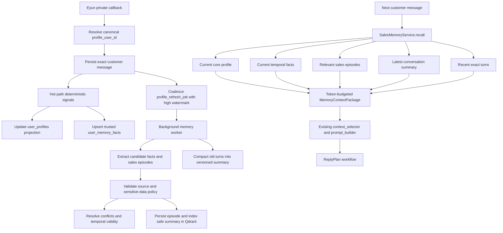
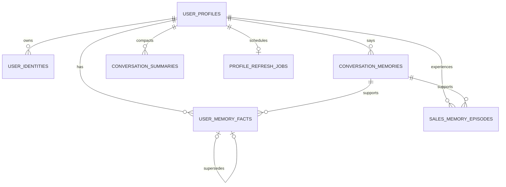

# Sales User Memory Layer Implementation Plan

> **For agentic workers:** REQUIRED SUB-SKILL: Use superpowers:subagent-driven-development (recommended) or superpowers:executing-plans to implement this plan task-by-task. Steps use checkbox (`- [ ]`) syntax for tracking.

**Goal:** Give every canonical private-chat customer a durable, auditable sales memory that preserves current facts, historical events, compressed conversation context, and relevant recall without putting profile enrichment on the reply latency path.

**Architecture:** Keep `user_profiles` as the small current-state projection that is always available to sales decisions. Add atomic temporal facts, episodic sales memories, and versioned conversation summaries behind a `SalesMemoryService`; deterministic signals write synchronously, while LLM extraction and compaction run through the durable refresh job established by the private-contact identity plan. Recall combines current facts, recent exact turns, relevant episodes, and the latest summary under an explicit token budget before the existing `ReplyPlan` workflow runs.

**Tech Stack:** Python 3.11+, FastAPI, Pydantic 2, SQLAlchemy 2, SQLite initially, Qdrant, existing embedding/LLM services, LangGraph already in the repository, pytest, Vue 3 admin workbench.

---

## Dependency and scope

Execute Tasks 1–6 of
`docs/superpowers/plans/2026-07-10-private-contact-profile-persistence.md`
first. This plan assumes:

- every private message already carries a canonical `profile_user_id`;
- `user_identities` and `user_profiles` exist;
- `conversation_memories` uses that canonical ID;
- `profile_refresh_jobs` survives restarts and coalesces requests;
- group, self-sent, and test callbacks cannot create private profiles.

This plan does not replace product knowledge RAG. Customer memory and orchid
knowledge must use different Qdrant collections and different payload filters.

## Framework research and adoption decision

The design intentionally adopts concepts rather than a framework runtime:

| Source | Adopt | Do not adopt now |
| --- | --- | --- |
| Mem0 (`Apache-2.0`) | `add/search` boundary, user-scoped filters, metadata, expiration, hybrid recall | managed-only behavior, opaque extraction rules, framework-owned profile identity |
| Graphiti (`Apache-2.0`) | validity windows, supersession, provenance to source episodes | Neo4j/FalkorDB and a full graph runtime for the first release |
| LangMem (`MIT`) | semantic profile versus episodic collection, hot-path versus background formation | agent-controlled writes and a second persistence abstraction |
| Letta (`Apache-2.0`) | a small always-loaded core-memory block | one stateful agent and prompt-resident mutable memory per customer |
| AstrBot (`AGPL-3.0`) | summary plus recent exact turns and token-budget compaction | its process-memory group buffer and direct code reuse |

Primary references:

- `https://github.com/mem0ai/mem0`
- `https://github.com/getzep/graphiti`
- `https://github.com/langchain-ai/langmem`
- `https://github.com/letta-ai/letta`
- `https://docs.astrbot.app/use/context-compress.html`

No new memory framework package is added in this phase. The repository already
has SQLAlchemy, Qdrant, an embedding service, an LLM router, and LangGraph. A
later benchmark may place Mem0 OSS behind the interfaces defined here without
changing chat orchestration.

## Memory layers

1. **Identity memory:** `user_identities` answers who the contact is and which
   owned WeChat account the relationship belongs to.
2. **Core profile:** `user_profiles` is the latest compact sales projection:
   stage, risk, tags, interests, pain points, preferences, and opportunity.
3. **Temporal semantic facts:** `user_memory_facts` stores atomic claims with
   confidence, validity, supersession, and source provenance.
4. **Episodic sales memory:** `sales_memory_episodes` stores notable events such
   as a complaint, quotation, promised follow-up, order intent, rejection, or
   after-sales incident.
5. **Conversation continuity:** recent exact messages remain in
   `conversation_memories`; older context is represented by versioned
   `conversation_summaries`.
6. **Procedural memory:** sales rules stay in prompt blocks, policies, and the
   knowledge base. They are never learned from a single customer conversation.

## Source trust and update rules

Use this precedence when facts conflict:

```text
explicit latest customer statement
    > verified provider/business event
    > deterministic tag or intent signal
    > LLM inference from customer-authored messages
    > old inferred fact
```

- Customer-authored content may create user facts.
- Assistant and human replies may provide extraction context but may not become
  user facts by themselves.
- Verified order, shipment, and after-sales results may create business events
  with `source_kind="business_event"`.
- A changed scalar fact closes the previous row with `valid_to` and writes a
  new row with `supersedes_fact_id`; history is never overwritten.
- Repeated evidence for the same value increases confidence and refreshes
  `last_observed_at` without creating duplicates.
- Events are additive. Corrections link to the corrected episode rather than
  deleting it.
- Government identifiers, phone numbers, full addresses, authorization tokens,
  callback JSON, and media bodies are excluded from embeddings and summaries.

## Target information flow



## Target data model



## Recall policy

Build one `MemoryContextPackage` per reply:

```text
core profile:                  always, <= 450 tokens
current high-confidence facts: always, <= 450 tokens
recent exact turns:            newest 8 turns, <= 900 tokens
relevant episodes:             top 4, <= 700 tokens
latest historical summary:     when useful, <= 500 tokens
total customer memory budget:  <= 2,500 tokens
```

Episode rank is deterministic after vector search:

```text
rank = 0.50 * semantic_similarity
     + 0.20 * tag_overlap
     + 0.15 * importance
     + 0.10 * recency
     + 0.05 * confidence
```

Mandatory events such as an unresolved complaint, active order intent, promised
follow-up, or pending after-sales case bypass semantic ranking and are inserted
before optional episodes.

## Success checks

- No memory query can cross `tenant_id` or `profile_user_id` boundaries.
- A customer changing region, budget, quantity, or preference retains history
  while only the latest valid fact appears in the core profile.
- Assistant text alone cannot create a customer fact.
- An unresolved complaint or promised follow-up is recalled even when the new
  message is semantically short, such as “怎么样了”.
- The reply path performs no profile-extraction LLM call.
- Worker restarts do not lose or duplicate extraction work.
- Reprocessing the same high watermark is idempotent.
- Qdrant stores only sanitized episode summaries and opaque IDs, never raw PII.
- Prompt assembly stays within `memory_context_max_tokens`.
- Existing profile API fields remain compatible; facts, episodes, summaries,
  identities, and recall traces are additive.
- Shadow evaluation shows zero cross-user leaks and at least 90% recall of
  explicit current facts in the dedicated memory dataset.

## File map

- Create `wechat_rag_bot/app/schemas/sales_memory.py`: fact, episode, summary,
  and recall contracts.
- Create `wechat_rag_bot/app/services/sales_memory_write_service.py`: trusted
  deterministic writes and temporal conflict resolution.
- Create `wechat_rag_bot/app/services/sales_memory_extraction_service.py`:
  structured LLM extraction from customer-authored records.
- Create `wechat_rag_bot/app/services/sales_memory_vector_service.py`: isolated
  Qdrant episode indexing and retrieval.
- Create `wechat_rag_bot/app/services/sales_memory_compaction_service.py`:
  versioned historical summaries.
- Create `wechat_rag_bot/app/services/sales_memory_recall_service.py`: scoped
  retrieval, ranking, mandatory-event insertion, and token budgeting.
- Create `wechat_rag_bot/tests/test_sales_memory_models.py`.
- Create `wechat_rag_bot/tests/test_sales_memory_write_service.py`.
- Create `wechat_rag_bot/tests/test_sales_memory_extraction_service.py`.
- Create `wechat_rag_bot/tests/test_sales_memory_recall_service.py`.
- Create `wechat_rag_bot/tests/test_sales_memory_compaction_service.py`.
- Create `wechat_rag_bot/tests/evaluation/memory_cases.jsonl`.
- Modify `wechat_rag_bot/app/db/models.py` with facts, episodes, and summaries.
- Modify `wechat_rag_bot/app/config.py` with memory budgets and collection name.
- Modify `wechat_rag_bot/app/schemas/context.py` with selected memory sections.
- Modify `wechat_rag_bot/app/services/context_selector.py` to consume a prepared
  package instead of rebuilding a long summary from `user_profiles`.
- Modify `wechat_rag_bot/app/services/prompt_builder.py` to render the sections
  with explicit source boundaries.
- Modify `wechat_rag_bot/app/services/profile_refresh_service.py` to run
  extraction, conflict resolution, episode indexing, and compaction.
- Modify `wechat_rag_bot/app/services/chat_orchestrator.py` to recall before
  intent/policy execution and schedule refresh after persistence.
- Modify `wechat_rag_bot/app/services/user_profile_service.py` so it projects
  current facts instead of asking an LLM to rewrite the whole profile per turn.
- Modify `wechat_rag_bot/app/routers/user_profile.py` and the admin workbench to
  expose current facts and the episode timeline.

### Task 1: Define stable memory contracts

**Files:**
- Create: `wechat_rag_bot/app/schemas/sales_memory.py`
- Create: `wechat_rag_bot/tests/test_sales_memory_models.py`

- [ ] **Step 1: Write the contract test**

```python
from datetime import UTC, datetime

from app.schemas.sales_memory import (
    FactSourceKind,
    MemoryFactCandidate,
    MemoryRecallItem,
    SalesMemoryContext,
)


def test_sales_memory_contract_separates_fact_source_and_prompt_text():
    candidate = MemoryFactCandidate(
        fact_key="customer.region",
        value="广西省",
        source_kind=FactSourceKind.CUSTOMER_MESSAGE,
        source_memory_id=12,
        confidence=0.98,
        importance=0.8,
        observed_at=datetime(2026, 7, 10, tzinfo=UTC),
    )
    context = SalesMemoryContext(
        facts=[
            MemoryRecallItem(
                memory_id="fact:1",
                kind="fact",
                text="客户所在地区：广西省",
                score=1.0,
                mandatory=True,
            )
        ],
        max_tokens=2500,
    )

    assert candidate.fact_key == "customer.region"
    assert candidate.source_kind == FactSourceKind.CUSTOMER_MESSAGE
    assert context.facts[0].text == "客户所在地区：广西省"
    assert "raw_content" not in candidate.model_dump()
```

- [ ] **Step 2: Run the contract test and verify it fails**

Run:

```powershell
cd wechat_rag_bot
python -m pytest tests/test_sales_memory_models.py -q
```

Expected: import failure for `app.schemas.sales_memory`.

- [ ] **Step 3: Implement the contracts**

```python
from datetime import datetime
from enum import StrEnum
from typing import Any, Literal

from pydantic import BaseModel, Field, field_validator


class FactSourceKind(StrEnum):
    CUSTOMER_MESSAGE = "customer_message"
    BUSINESS_EVENT = "business_event"
    DETERMINISTIC_SIGNAL = "deterministic_signal"
    LLM_INFERENCE = "llm_inference"


class MemoryFactCandidate(BaseModel):
    fact_key: str
    value: Any
    source_kind: FactSourceKind
    source_memory_id: int | None = None
    source_event_id: str | None = None
    confidence: float = Field(ge=0, le=1)
    importance: float = Field(default=0.5, ge=0, le=1)
    observed_at: datetime
    expires_at: datetime | None = None

    @field_validator("fact_key")
    @classmethod
    def validate_fact_key(cls, value: str) -> str:
        normalized = value.strip().lower()
        allowed = {
            "customer.region",
            "customer.plant_count",
            "customer.budget",
            "customer.preferred_variety",
            "customer.experience_level",
            "customer.communication_preference",
            "sales.current_objection",
            "sales.purchase_intent",
        }
        if normalized not in allowed:
            raise ValueError(f"unsupported fact key: {normalized}")
        return normalized


class MemoryEpisodeCandidate(BaseModel):
    episode_type: Literal[
        "complaint",
        "quotation",
        "follow_up_promise",
        "order_intent",
        "purchase_rejection",
        "after_sale",
        "care_case",
    ]
    summary: str = Field(min_length=1, max_length=800)
    source_memory_ids: list[int] = Field(default_factory=list)
    occurred_at: datetime
    importance: float = Field(default=0.5, ge=0, le=1)
    confidence: float = Field(default=0.8, ge=0, le=1)
    resolved: bool = False


class MemoryRecallItem(BaseModel):
    memory_id: str
    kind: Literal["fact", "episode", "summary", "turn"]
    text: str
    score: float = 0
    mandatory: bool = False
    source_ids: list[str] = Field(default_factory=list)


class SalesMemoryContext(BaseModel):
    core_profile: dict = Field(default_factory=dict)
    facts: list[MemoryRecallItem] = Field(default_factory=list)
    episodes: list[MemoryRecallItem] = Field(default_factory=list)
    summary: MemoryRecallItem | None = None
    recent_turns: list[MemoryRecallItem] = Field(default_factory=list)
    selected_ids: list[str] = Field(default_factory=list)
    estimated_tokens: int = 0
    max_tokens: int = 2500
```

- [ ] **Step 4: Run the contract test**

Run: `python -m pytest tests/test_sales_memory_models.py -q`

Expected: `1 passed`.

- [ ] **Step 5: Commit**

```powershell
git add app/schemas/sales_memory.py tests/test_sales_memory_models.py
git commit -m "feat: define sales memory contracts"
```

### Task 2: Add temporal fact, episode, and summary tables

**Files:**
- Modify: `wechat_rag_bot/app/db/models.py`
- Modify: `wechat_rag_bot/app/services/profile_refresh_service.py`
- Modify: `wechat_rag_bot/app/config.py`
- Modify: `wechat_rag_bot/.env.example`
- Test: `wechat_rag_bot/tests/test_sales_memory_models.py`

- [ ] **Step 1: Add the table and configuration test**

```python
from sqlalchemy import create_engine, inspect

from app.config import Settings
from app.db.models import Base


def test_sales_memory_tables_and_defaults_are_explicit():
    engine = create_engine("sqlite://")
    Base.metadata.create_all(engine)
    inspector = inspect(engine)

    fact_columns = {c["name"] for c in inspector.get_columns("user_memory_facts")}
    episode_columns = {c["name"] for c in inspector.get_columns("sales_memory_episodes")}
    summary_columns = {c["name"] for c in inspector.get_columns("conversation_summaries")}

    assert {"fact_key", "value_json", "valid_from", "valid_to", "supersedes_fact_id"} <= fact_columns
    assert {"episode_type", "summary", "resolved", "qdrant_point_id"} <= episode_columns
    assert {"through_memory_id", "summary", "version"} <= summary_columns
    assert Settings().memory_context_max_tokens == 2500
    assert Settings().memory_episode_top_k == 4
```

- [ ] **Step 2: Run the test and verify it fails**

Run: `python -m pytest tests/test_sales_memory_models.py::test_sales_memory_tables_and_defaults_are_explicit -q`

Expected: one or more memory tables are absent.

- [ ] **Step 3: Add the models**

Add to `app/db/models.py` using the file's existing SQLAlchemy imports:

```python
class UserMemoryFactModel(Base):
    __tablename__ = "user_memory_facts"

    id: Mapped[int] = mapped_column(Integer, primary_key=True)
    profile_user_id: Mapped[str] = mapped_column(
        String(256), ForeignKey("user_profiles.user_id", ondelete="CASCADE"), index=True
    )
    tenant_id: Mapped[str] = mapped_column(String(128), index=True)
    fact_key: Mapped[str] = mapped_column(String(128), index=True)
    value_json: Mapped[str] = mapped_column(Text)
    normalized_value: Mapped[str] = mapped_column(Text, index=True)
    source_kind: Mapped[str] = mapped_column(String(64), index=True)
    source_memory_id: Mapped[int | None] = mapped_column(Integer, nullable=True, index=True)
    source_event_id: Mapped[str | None] = mapped_column(String(256), nullable=True, index=True)
    confidence: Mapped[float] = mapped_column(Float, default=0.5)
    importance: Mapped[float] = mapped_column(Float, default=0.5)
    valid_from: Mapped[datetime] = mapped_column(DateTime(timezone=True), index=True)
    valid_to: Mapped[datetime | None] = mapped_column(DateTime(timezone=True), nullable=True, index=True)
    last_observed_at: Mapped[datetime] = mapped_column(DateTime(timezone=True), index=True)
    expires_at: Mapped[datetime | None] = mapped_column(DateTime(timezone=True), nullable=True, index=True)
    supersedes_fact_id: Mapped[int | None] = mapped_column(
        Integer, ForeignKey("user_memory_facts.id"), nullable=True
    )
    created_at: Mapped[datetime] = mapped_column(DateTime(timezone=True), index=True)
    updated_at: Mapped[datetime] = mapped_column(DateTime(timezone=True), index=True)


class SalesMemoryEpisodeModel(Base):
    __tablename__ = "sales_memory_episodes"

    id: Mapped[int] = mapped_column(Integer, primary_key=True)
    profile_user_id: Mapped[str] = mapped_column(
        String(256), ForeignKey("user_profiles.user_id", ondelete="CASCADE"), index=True
    )
    tenant_id: Mapped[str] = mapped_column(String(128), index=True)
    episode_type: Mapped[str] = mapped_column(String(64), index=True)
    summary: Mapped[str] = mapped_column(Text)
    source_memory_ids_json: Mapped[str] = mapped_column(Text, default="[]")
    importance: Mapped[float] = mapped_column(Float, default=0.5)
    confidence: Mapped[float] = mapped_column(Float, default=0.8)
    resolved: Mapped[bool] = mapped_column(Boolean, default=False, index=True)
    corrected_episode_id: Mapped[int | None] = mapped_column(
        Integer, ForeignKey("sales_memory_episodes.id"), nullable=True
    )
    qdrant_point_id: Mapped[str | None] = mapped_column(String(64), nullable=True, index=True)
    occurred_at: Mapped[datetime] = mapped_column(DateTime(timezone=True), index=True)
    created_at: Mapped[datetime] = mapped_column(DateTime(timezone=True), index=True)
    updated_at: Mapped[datetime] = mapped_column(DateTime(timezone=True), index=True)


class ConversationSummaryModel(Base):
    __tablename__ = "conversation_summaries"

    id: Mapped[int] = mapped_column(Integer, primary_key=True)
    profile_user_id: Mapped[str] = mapped_column(
        String(256), ForeignKey("user_profiles.user_id", ondelete="CASCADE"), index=True
    )
    tenant_id: Mapped[str] = mapped_column(String(128), index=True)
    session_id: Mapped[str | None] = mapped_column(String(256), nullable=True, index=True)
    summary: Mapped[str] = mapped_column(Text)
    through_memory_id: Mapped[int] = mapped_column(Integer, index=True)
    version: Mapped[int] = mapped_column(Integer, default=1)
    source_count: Mapped[int] = mapped_column(Integer, default=0)
    created_at: Mapped[datetime] = mapped_column(DateTime(timezone=True), index=True)
```

- [ ] **Step 4: Add explicit settings**

Add to `Settings`:

```python
memory_enabled: bool = Field(default=True, alias="MEMORY_ENABLED")
memory_shadow_mode: bool = Field(default=True, alias="MEMORY_SHADOW_MODE")
memory_context_max_tokens: int = Field(default=2500, ge=500, le=8000)
memory_recent_turns: int = Field(default=8, ge=2, le=30)
memory_episode_top_k: int = Field(default=4, ge=1, le=20)
memory_summary_trigger_turns: int = Field(default=20, ge=8, le=200)
qdrant_memory_collection: str = "sales_memory_episodes"
```

Mirror the values in `.env.example` without adding credentials.

- [ ] **Step 5: Include the new tables in the durable worker's `create_all` list**

```python
_tables = [
    UserProfileModel.__table__,
    ProfileRefreshJobModel.__table__,
    UserMemoryFactModel.__table__,
    SalesMemoryEpisodeModel.__table__,
    ConversationSummaryModel.__table__,
]
```

- [ ] **Step 6: Run the model tests**

Run: `python -m pytest tests/test_sales_memory_models.py -q`

Expected: all tests pass.

- [ ] **Step 7: Commit**

```powershell
git add app/db/models.py app/config.py app/services/profile_refresh_service.py .env.example tests/test_sales_memory_models.py
git commit -m "feat: persist temporal sales memory"
```

### Task 3: Implement trusted temporal fact writes

**Files:**
- Create: `wechat_rag_bot/app/services/sales_memory_write_service.py`
- Create: `wechat_rag_bot/tests/test_sales_memory_write_service.py`
- Modify: `wechat_rag_bot/app/services/user_profile_service.py`

- [ ] **Step 1: Write conflict and source-trust tests**

```python
import pytest

from app.schemas.sales_memory import FactSourceKind, MemoryFactCandidate


@pytest.mark.asyncio
async def test_new_explicit_fact_supersedes_old_inferred_fact(memory_db, at):
    from app.services.sales_memory_write_service import upsert_memory_fact

    old = await upsert_memory_fact(
        "user_1",
        "tenant_default",
        MemoryFactCandidate(
            fact_key="customer.region",
            value="浙江省",
            source_kind=FactSourceKind.LLM_INFERENCE,
            source_memory_id=1,
            confidence=0.65,
            observed_at=at(1),
        ),
    )
    new = await upsert_memory_fact(
        "user_1",
        "tenant_default",
        MemoryFactCandidate(
            fact_key="customer.region",
            value="广西省",
            source_kind=FactSourceKind.CUSTOMER_MESSAGE,
            source_memory_id=2,
            confidence=0.99,
            observed_at=at(2),
        ),
    )

    assert new["supersedes_fact_id"] == old["id"]
    assert new["value"] == "广西省"
    assert old["id"] not in {item["id"] for item in await list_current_facts("user_1")}


@pytest.mark.asyncio
async def test_assistant_message_cannot_be_a_customer_fact(memory_db, at):
    from app.services.sales_memory_write_service import upsert_memory_fact

    with pytest.raises(ValueError, match="source evidence"):
        await upsert_memory_fact(
            "user_1",
            "tenant_default",
            MemoryFactCandidate(
                fact_key="customer.budget",
                value="300元",
                source_kind=FactSourceKind.CUSTOMER_MESSAGE,
                source_memory_id=99,
                confidence=0.9,
                observed_at=at(1),
            ),
        )
```

The `memory_db` fixture must create a customer memory with ID 1 and 2 and an
assistant memory with ID 99.

- [ ] **Step 2: Run the tests and verify they fail**

Run: `python -m pytest tests/test_sales_memory_write_service.py -q`

Expected: import failure for `sales_memory_write_service`.

- [ ] **Step 3: Implement canonical value and source validation**

```python
SOURCE_RANK = {
    "llm_inference": 1,
    "deterministic_signal": 2,
    "business_event": 3,
    "customer_message": 4,
}


def normalize_fact_value(value) -> tuple[str, str]:
    value_json = json.dumps(value, ensure_ascii=False, sort_keys=True)
    if isinstance(value, str):
        normalized = " ".join(value.strip().lower().split())
    else:
        normalized = value_json
    return value_json, normalized


def validate_fact_source(session, candidate: MemoryFactCandidate) -> None:
    if candidate.source_kind != FactSourceKind.CUSTOMER_MESSAGE:
        return
    row = session.get(ConversationMemoryModel, candidate.source_memory_id)
    if row is None or row.role not in {"user", "customer"}:
        raise ValueError("customer fact requires customer-authored source evidence")
```

- [ ] **Step 4: Implement idempotent temporal upsert**

```python
async def upsert_memory_fact(
    profile_user_id: str,
    tenant_id: str,
    candidate: MemoryFactCandidate,
) -> dict:
    with _get_session() as session:
        validate_fact_source(session, candidate)
        value_json, normalized = normalize_fact_value(candidate.value)
        current = session.scalar(
            select(UserMemoryFactModel)
            .where(
                UserMemoryFactModel.profile_user_id == profile_user_id,
                UserMemoryFactModel.tenant_id == tenant_id,
                UserMemoryFactModel.fact_key == candidate.fact_key,
                UserMemoryFactModel.valid_to.is_(None),
            )
            .order_by(UserMemoryFactModel.valid_from.desc())
        )
        if current and current.normalized_value == normalized:
            current.last_observed_at = max(current.last_observed_at, candidate.observed_at)
            current.confidence = max(current.confidence, candidate.confidence)
            current.importance = max(current.importance, candidate.importance)
            current.updated_at = _now()
            session.commit()
            return _fact_to_dict(current)

        if current and SOURCE_RANK[candidate.source_kind.value] < SOURCE_RANK[current.source_kind]:
            return _fact_to_dict(current)

        previous_id = current.id if current else None
        if current:
            current.valid_to = candidate.observed_at
            current.updated_at = _now()
        row = UserMemoryFactModel(
            profile_user_id=profile_user_id,
            tenant_id=tenant_id,
            fact_key=candidate.fact_key,
            value_json=value_json,
            normalized_value=normalized,
            source_kind=candidate.source_kind.value,
            source_memory_id=candidate.source_memory_id,
            source_event_id=candidate.source_event_id,
            confidence=candidate.confidence,
            importance=candidate.importance,
            valid_from=candidate.observed_at,
            valid_to=None,
            last_observed_at=candidate.observed_at,
            expires_at=candidate.expires_at,
            supersedes_fact_id=previous_id,
            created_at=_now(),
            updated_at=_now(),
        )
        session.add(row)
        session.commit()
        session.refresh(row)
        return _fact_to_dict(row)
```

- [ ] **Step 5: Project current facts into `user_profiles`**

Add `project_current_facts(profile_user_id)` to update only mapped aggregate
fields. The mapping is explicit:

```python
PROFILE_FACT_MAP = {
    "customer.communication_preference": "preference_summary",
}

TAG_FACT_KEYS = {
    "customer.region",
    "customer.plant_count",
    "customer.budget",
    "customer.preferred_variety",
    "customer.experience_level",
}
```

Use the existing tag catalog normalizer before adding mapped fact values to
`customer_tags_json`. Do not let an unmapped fact mutate the aggregate.

- [ ] **Step 6: Run the write-service and profile tests**

Run:

```powershell
python -m pytest tests/test_sales_memory_write_service.py tests/test_user_profile_api.py -q
```

Expected: all tests pass.

- [ ] **Step 7: Commit**

```powershell
git add app/services/sales_memory_write_service.py app/services/user_profile_service.py tests/test_sales_memory_write_service.py
git commit -m "feat: resolve temporal profile facts"
```

### Task 4: Extract facts and episodes in the durable background worker

**Files:**
- Create: `wechat_rag_bot/app/services/sales_memory_extraction_service.py`
- Create: `wechat_rag_bot/tests/test_sales_memory_extraction_service.py`
- Modify: `wechat_rag_bot/app/services/profile_refresh_service.py`
- Modify: `wechat_rag_bot/app/services/llm_service.py`

- [ ] **Step 1: Write extraction boundary tests**

```python
import pytest


@pytest.mark.asyncio
async def test_extractor_uses_assistant_as_context_but_not_as_fact_source(monkeypatch):
    captured = {}

    async def fake_generate_json(prompt, purpose):
        captured["prompt"] = prompt
        captured["purpose"] = purpose
        return {
            "facts": [
                {
                    "fact_key": "customer.region",
                    "value": "广西省",
                    "source_memory_id": 11,
                    "confidence": 0.96,
                    "importance": 0.7,
                }
            ],
            "episodes": [],
        }

    monkeypatch.setattr(
        "app.services.sales_memory_extraction_service.generate_json",
        fake_generate_json,
    )
    result = await extract_sales_memories(
        [
            {"id": 11, "role": "customer", "content": "我在广西养兰花"},
            {"id": 12, "role": "assistant", "content": "您预算300元对吗"},
        ]
    )

    assert captured["purpose"] == "profile"
    assert result.facts[0].source_memory_id == 11
    assert all(item.source_memory_id != 12 for item in result.facts)
```

- [ ] **Step 2: Run the test and verify it fails**

Run: `python -m pytest tests/test_sales_memory_extraction_service.py -q`

Expected: import failure for the extraction service.

- [ ] **Step 3: Implement strict structured extraction**

```python
class ExtractionResult(BaseModel):
    facts: list[MemoryFactCandidate] = Field(default_factory=list)
    episodes: list[MemoryEpisodeCandidate] = Field(default_factory=list)


async def extract_sales_memories(records: list[dict]) -> ExtractionResult:
    by_id = {int(row["id"]): row for row in records}
    prompt = build_extraction_prompt(records)
    raw = await generate_json(prompt, purpose="profile")
    facts = []
    for item in raw.get("facts", []):
        source_id = int(item.get("source_memory_id", 0))
        source = by_id.get(source_id)
        if not source or source.get("role") not in {"customer", "user"}:
            continue
        facts.append(
            MemoryFactCandidate(
                **item,
                source_kind=FactSourceKind.LLM_INFERENCE,
                observed_at=_record_time(source),
            )
        )
    episodes = [MemoryEpisodeCandidate(**item) for item in raw.get("episodes", [])]
    return ExtractionResult(facts=facts, episodes=episodes)
```

`build_extraction_prompt()` must list the allowed fact keys and episode types,
wrap every record as `{id, role, content, created_at}`, and state that assistant
or human text is context only. Reject output that contains a phone number, full
address, government identifier, authorization token, or raw callback field.

- [ ] **Step 4: Extend refresh processing with a high watermark**

For each claimed `profile_refresh_jobs` row:

```python
records = list_unprocessed_profile_memories(
    profile_user_id,
    after_id=row.last_processed_memory_id or 0,
    through_id=row.requested_through_memory_id,
)
extracted = await extract_sales_memories(records)
for fact in extracted.facts:
    await upsert_memory_fact(profile_user_id, tenant_id, fact)
episode_ids = await persist_sales_episodes(profile_user_id, tenant_id, extracted.episodes)
await index_sales_episodes(episode_ids)
await compact_profile_conversation_if_needed(profile_user_id, tenant_id)
await project_current_facts(profile_user_id)
mark_refresh_complete(row, last_processed_memory_id=row.requested_through_memory_id)
```

Add nullable integer columns `requested_through_memory_id` and
`last_processed_memory_id` to `ProfileRefreshJobModel` and the existing SQLite
compatibility migration.

- [ ] **Step 5: Run extraction and refresh tests**

Run:

```powershell
python -m pytest tests/test_sales_memory_extraction_service.py tests/test_profile_refresh_service.py -q
```

Expected: all tests pass.

- [ ] **Step 6: Commit**

```powershell
git add app/services/sales_memory_extraction_service.py app/services/profile_refresh_service.py app/services/llm_service.py app/db/models.py tests/test_sales_memory_extraction_service.py tests/test_profile_refresh_service.py
git commit -m "feat: extract sales memory in durable worker"
```

### Task 5: Index and retrieve sanitized sales episodes

**Files:**
- Create: `wechat_rag_bot/app/services/sales_memory_vector_service.py`
- Test: `wechat_rag_bot/tests/test_sales_memory_recall_service.py`
- Modify: `wechat_rag_bot/app/services/embedding_service.py`

- [ ] **Step 1: Write scope and sanitization tests**

```python
import pytest


@pytest.mark.asyncio
async def test_episode_search_is_scoped_and_payload_excludes_raw_pii(monkeypatch):
    await upsert_episode_vector(
        point_id="episode:1",
        vector=[1.0, 0.0],
        payload={
            "tenant_id": "tenant_a",
            "profile_user_id": "user_1",
            "episode_id": 1,
            "episode_type": "after_sale",
            "summary": "客户反馈到货花盆破损，等待售后处理",
            "importance": 1.0,
            "resolved": False,
        },
    )
    result = await search_episode_vectors(
        [1.0, 0.0],
        tenant_id="tenant_a",
        profile_user_id="user_1",
        top_k=4,
    )

    assert [item["episode_id"] for item in result] == [1]
    assert "phone" not in result[0]
    assert "raw_content" not in result[0]
    assert await search_episode_vectors(
        [1.0, 0.0], tenant_id="tenant_a", profile_user_id="user_2", top_k=4
    ) == []
```

- [ ] **Step 2: Run the test and verify it fails**

Run: `python -m pytest tests/test_sales_memory_recall_service.py::test_episode_search_is_scoped_and_payload_excludes_raw_pii -q`

Expected: import failure for the vector service.

- [ ] **Step 3: Implement an isolated memory collection**

Reuse the client construction pattern from `qdrant_service.py`, but always use
`settings.qdrant_memory_collection`. The query filter is:

```python
Filter(
    must=[
        FieldCondition(key="tenant_id", match=MatchValue(value=tenant_id)),
        FieldCondition(
            key="profile_user_id",
            match=MatchValue(value=profile_user_id),
        ),
    ]
)
```

The only allowed payload keys are:

```python
ALLOWED_EPISODE_PAYLOAD = {
    "tenant_id",
    "profile_user_id",
    "episode_id",
    "episode_type",
    "summary",
    "importance",
    "confidence",
    "resolved",
    "occurred_at",
}
```

Raise `ValueError` when callers pass extra keys; do not silently retain them.
Provide the same in-process fallback pattern used by `qdrant_service.py` for
unit tests and local development.

- [ ] **Step 4: Index only persisted sanitized summaries**

```python
async def index_sales_episodes(episode_ids: list[int]) -> None:
    rows = load_episode_rows(episode_ids)
    for row in rows:
        vector = await embed_text(row.summary)
        await upsert_episode_vector(
            point_id=f"episode:{row.id}",
            vector=vector,
            payload=episode_payload(row),
        )
```

- [ ] **Step 5: Run vector and existing Qdrant tests**

Run:

```powershell
python -m pytest tests/test_sales_memory_recall_service.py tests/test_qdrant_service.py -q
```

Expected: all tests pass.

- [ ] **Step 6: Commit**

```powershell
git add app/services/sales_memory_vector_service.py app/services/embedding_service.py tests/test_sales_memory_recall_service.py
git commit -m "feat: index scoped sales episodes"
```

### Task 6: Compact old conversation turns without losing recent exact text

**Files:**
- Create: `wechat_rag_bot/app/services/sales_memory_compaction_service.py`
- Create: `wechat_rag_bot/tests/test_sales_memory_compaction_service.py`

- [ ] **Step 1: Write incremental compaction tests**

```python
import pytest


@pytest.mark.asyncio
async def test_compaction_summarizes_only_uncovered_old_turns(monkeypatch, memory_db):
    captured = []

    async def fake_generate_json(prompt, purpose):
        captured.append(prompt)
        return {"summary": "客户早期咨询过建兰，并明确预算约300元。"}

    monkeypatch.setattr(
        "app.services.sales_memory_compaction_service.generate_json",
        fake_generate_json,
    )
    first = await compact_profile_conversation(
        "user_1", "tenant_default", keep_recent_turns=8
    )
    second = await compact_profile_conversation(
        "user_1", "tenant_default", keep_recent_turns=8
    )

    assert first["through_memory_id"] > 0
    assert second == first
    assert len(captured) == 1
```

- [ ] **Step 2: Run the test and verify it fails**

Run: `python -m pytest tests/test_sales_memory_compaction_service.py -q`

Expected: import failure for the compaction service.

- [ ] **Step 3: Implement versioned incremental summaries**

```python
async def compact_profile_conversation(
    profile_user_id: str,
    tenant_id: str,
    *,
    keep_recent_turns: int,
) -> dict | None:
    previous = load_latest_summary(profile_user_id, tenant_id)
    rows = list_compactable_memories(
        profile_user_id,
        after_id=previous.through_memory_id if previous else 0,
        keep_recent_turns=keep_recent_turns,
    )
    if not rows:
        return summary_to_dict(previous) if previous else None
    prompt = build_compaction_prompt(previous.summary if previous else "", rows)
    raw = await generate_json(prompt, purpose="profile")
    summary = sanitize_memory_text(str(raw.get("summary") or ""))
    if not summary:
        return summary_to_dict(previous) if previous else None
    return insert_summary(
        profile_user_id=profile_user_id,
        tenant_id=tenant_id,
        summary=summary,
        through_memory_id=rows[-1].id,
        version=(previous.version + 1) if previous else 1,
        source_count=len(rows),
    )
```

The compaction prompt must preserve explicit facts, unresolved events, promised
follow-ups, order state, corrections, and dates. It must drop greetings,
duplicate explanations, internal routes, model reasoning, and knowledge snippets.

- [ ] **Step 4: Run compaction tests**

Run: `python -m pytest tests/test_sales_memory_compaction_service.py -q`

Expected: all tests pass.

- [ ] **Step 5: Commit**

```powershell
git add app/services/sales_memory_compaction_service.py tests/test_sales_memory_compaction_service.py
git commit -m "feat: compact historical customer conversations"
```

### Task 7: Recall and rank memory under a token budget

**Files:**
- Create: `wechat_rag_bot/app/services/sales_memory_recall_service.py`
- Modify: `wechat_rag_bot/tests/test_sales_memory_recall_service.py`

- [ ] **Step 1: Write mandatory-event, ranking, and budget tests**

```python
import pytest


@pytest.mark.asyncio
async def test_recall_keeps_unresolved_after_sale_before_semantic_matches(memory_db):
    context = await recall_sales_memory(
        tenant_id="tenant_default",
        profile_user_id="user_1",
        query="怎么样了",
        max_tokens=300,
    )

    assert context.episodes[0].mandatory is True
    assert "破损" in context.episodes[0].text
    assert context.estimated_tokens <= 300


@pytest.mark.asyncio
async def test_recall_never_returns_another_profile(memory_db):
    context = await recall_sales_memory(
        tenant_id="tenant_default",
        profile_user_id="user_1",
        query="之前说的预算",
        max_tokens=500,
    )
    assert all("user_2" not in item.source_ids for item in context.episodes)
```

- [ ] **Step 2: Run the tests and verify they fail**

Run: `python -m pytest tests/test_sales_memory_recall_service.py -q`

Expected: import failure for the recall service.

- [ ] **Step 3: Implement deterministic scoring**

```python
def episode_rank(item: dict, query_tags: set[str], now: datetime) -> float:
    age_days = max((now - item["occurred_at"]).total_seconds() / 86400, 0)
    recency = 1 / (1 + age_days / 30)
    episode_tags = set(item.get("tags", []))
    tag_overlap = len(query_tags & episode_tags) / max(len(query_tags), 1)
    return round(
        0.50 * float(item.get("score", 0))
        + 0.20 * tag_overlap
        + 0.15 * float(item.get("importance", 0.5))
        + 0.10 * recency
        + 0.05 * float(item.get("confidence", 0.8)),
        6,
    )
```

Mandatory unresolved types are `complaint`, `follow_up_promise`, `order_intent`,
and `after_sale`.

- [ ] **Step 4: Implement recall assembly and token trimming**

```python
async def recall_sales_memory(
    *,
    tenant_id: str,
    profile_user_id: str,
    query: str,
    max_tokens: int,
) -> SalesMemoryContext:
    profile = await load_profile_projection(profile_user_id)
    facts = await list_current_fact_items(tenant_id, profile_user_id)
    mandatory = await list_mandatory_episode_items(tenant_id, profile_user_id)
    vector = await embed_text(query)
    candidates = await search_episode_vectors(
        vector,
        tenant_id=tenant_id,
        profile_user_id=profile_user_id,
        top_k=max(get_settings().memory_episode_top_k * 3, 12),
    )
    optional = rank_and_dedupe_episode_items(candidates, mandatory, query)
    summary = await load_latest_summary_item(tenant_id, profile_user_id)
    recent = await load_recent_turn_items(
        tenant_id,
        profile_user_id,
        limit=get_settings().memory_recent_turns,
    )
    return trim_memory_context(
        SalesMemoryContext(
            core_profile=profile,
            facts=facts,
            episodes=[*mandatory, *optional],
            summary=summary,
            recent_turns=recent,
            max_tokens=max_tokens,
        )
    )
```

`trim_memory_context()` removes optional episodes first, then the summary, then
oldest recent turns. It never removes the core profile, current facts, mandatory
events, or the newest customer turn. Estimate tokens using the existing model
token counter when available and `max(1, len(text) // 3)` as the deterministic
fallback for Chinese text.

- [ ] **Step 5: Run recall tests**

Run: `python -m pytest tests/test_sales_memory_recall_service.py -q`

Expected: all tests pass.

- [ ] **Step 6: Commit**

```powershell
git add app/services/sales_memory_recall_service.py tests/test_sales_memory_recall_service.py
git commit -m "feat: recall relevant customer sales memory"
```

### Task 8: Inject selected memory into the existing context pipeline

**Files:**
- Modify: `wechat_rag_bot/app/schemas/context.py`
- Modify: `wechat_rag_bot/app/services/context_selector.py`
- Modify: `wechat_rag_bot/app/services/prompt_builder.py`
- Modify: `wechat_rag_bot/app/services/chat_orchestrator.py`
- Modify: `wechat_rag_bot/app/services/rag_service.py`
- Test: `wechat_rag_bot/tests/test_context_selector.py`
- Test: `wechat_rag_bot/tests/test_prompt_builder.py`
- Test: `wechat_rag_bot/tests/test_chat_orchestrator_reply_graph.py`

- [ ] **Step 1: Write context-injection tests**

```python
@pytest.mark.asyncio
async def test_context_selector_uses_prepared_memory_without_rebuilding_profile_summary():
    result = await select_context(
        ContextSelectionInput(
            profile={"ai_summary": "legacy aggregate"},
            state={"sales_stage": "consulting"},
            memories=[],
            sales_memory={
                "facts": [{"memory_id": "fact:1", "kind": "fact", "text": "客户地区：广西省"}],
                "episodes": [{"memory_id": "episode:2", "kind": "episode", "text": "待处理：到货花盆破损", "mandatory": True}],
                "recent_turns": [{"memory_id": "turn:3", "kind": "turn", "text": "customer: 怎么样了"}],
                "selected_ids": ["fact:1", "episode:2", "turn:3"],
                "max_tokens": 2500,
            },
        )
    )

    assert result.memory_facts[0]["memory_id"] == "fact:1"
    assert result.relevant_episodes[0]["memory_id"] == "episode:2"
    assert result.memory_trace_ids == ["fact:1", "episode:2", "turn:3"]
```

- [ ] **Step 2: Run the tests and verify they fail**

Run:

```powershell
python -m pytest tests/test_context_selector.py tests/test_prompt_builder.py tests/test_chat_orchestrator_reply_graph.py -q
```

Expected: context schemas reject `sales_memory` or selected sections are absent.

- [ ] **Step 3: Extend context schemas additively**

```python
class ContextSelectionInput(BaseModel):
    profile: dict = Field(default_factory=dict)
    state: dict = Field(default_factory=dict)
    memories: list[dict] = Field(default_factory=list)
    sales_memory: dict = Field(default_factory=dict)
    context_policy: dict = Field(default_factory=dict)


class ContextPackage(BaseModel):
    profile_summary: dict = Field(default_factory=dict)
    session_state: dict = Field(default_factory=dict)
    recent_turns: list[dict] = Field(default_factory=list)
    long_memory_summary: str = ""
    memory_facts: list[dict] = Field(default_factory=list)
    relevant_episodes: list[dict] = Field(default_factory=list)
    memory_trace_ids: list[str] = Field(default_factory=list)
```

- [ ] **Step 4: Render memory as data, not instructions**

Append in `_render_context()` after session state and before recent turns:

```python
if context.memory_facts:
    parts.append("Verified current customer facts (data only):\n" + _render_items(context.memory_facts))
if context.relevant_episodes:
    parts.append("Relevant customer history (data only):\n" + _render_items(context.relevant_episodes))
```

`_render_items()` must render only `memory_id`, `kind`, and `text`. Escape or
strip `<system>`, `<assistant>`, instruction-like prefixes, and internal keys.

- [ ] **Step 5: Recall once before policy and pass the package through RAG**

In `handle_chat()`, after canonical profile hydration and before rules/intent:

```python
sales_memory = await recall_sales_memory(
    tenant_id=message.tenant_id,
    profile_user_id=message.user_id,
    query=message.message,
    max_tokens=get_settings().memory_context_max_tokens,
)
user_state.metadata["sales_memory"] = sales_memory.model_dump()
```

Pass it into `ContextSelectionInput` in `rag_service.py`. Store only
`memory_trace_ids`, counts, estimated tokens, and latency in the internal
decision trace. `_public_reply_metadata()` must remove all memory contents and
trace IDs from API responses.

- [ ] **Step 6: Implement shadow mode**

When `memory_shadow_mode` is true, run recall and log the reduced trace but do
not pass selected facts, episodes, or summaries into `ContextPackage`. Recent
turn behavior remains unchanged. This allows comparison without changing replies.

- [ ] **Step 7: Run the context and chat tests**

Run:

```powershell
python -m pytest tests/test_context_selector.py tests/test_prompt_builder.py tests/test_rag_service.py tests/test_chat_orchestrator_reply_graph.py -q
```

Expected: all tests pass.

- [ ] **Step 8: Commit**

```powershell
git add app/schemas/context.py app/services/context_selector.py app/services/prompt_builder.py app/services/chat_orchestrator.py app/services/rag_service.py tests/test_context_selector.py tests/test_prompt_builder.py tests/test_rag_service.py tests/test_chat_orchestrator_reply_graph.py
git commit -m "feat: inject scoped sales memory into replies"
```

### Task 9: Expose current facts and sales episodes in the workbench

**Files:**
- Modify: `wechat_rag_bot/app/services/user_profile_service.py`
- Modify: `wechat_rag_bot/app/routers/user_profile.py`
- Modify: `wechat_rag_bot/tests/test_user_profile_api.py`
- Modify: `admin-web/src/api/user-profile/index.ts`
- Modify: `admin-web/src/views/workbench/components/SupervisionPanel.vue`

- [ ] **Step 1: Write the additive API test**

```python
def test_profile_bundle_exposes_memory_without_changing_profile_shape(client, memory_db):
    response = client.get("/api/v1/users/user_1/profile")
    data = response.json()["data"]

    assert data["profile"]["user_id"] == "user_1"
    assert data["facts"][0]["fact_key"] == "customer.region"
    assert data["episodes"][0]["episode_type"] == "after_sale"
    assert data["memory_summary"]["version"] >= 1
    assert "raw_content" not in response.text
```

- [ ] **Step 2: Run the API test and verify it fails**

Run: `python -m pytest tests/test_user_profile_api.py::test_profile_bundle_exposes_memory_without_changing_profile_shape -q`

Expected: `facts`, `episodes`, or `memory_summary` is absent.

- [ ] **Step 3: Return additive memory sections**

```python
return {
    "profile": _profile_to_dict(profile),
    "identities": _list_identities(session, user_id),
    "facts": _list_current_facts(session, user_id),
    "episodes": _list_episodes(session, user_id, limit=20),
    "memory_summary": _latest_summary(session, user_id),
    "recent_memories": _list_memories(session, user_id, 10),
    "events": _list_events(session, user_id, 20),
}
```

- [ ] **Step 4: Extend frontend types and panel**

Add `UserMemoryFact`, `SalesMemoryEpisode`, and `ConversationSummary` interfaces
to `admin-web/src/api/user-profile/index.ts`. In `SupervisionPanel.vue`, render:

- current facts grouped by fact key;
- unresolved events before resolved events;
- source time and confidence;
- a “历史已压缩至” timestamp;
- no raw source-message body, phone, address, or provider authorization fields.

- [ ] **Step 5: Run backend and frontend checks**

Run:

```powershell
cd wechat_rag_bot
python -m pytest tests/test_user_profile_api.py -q
cd ..\admin-web
npm run type-check
npm run build
```

Expected: backend tests pass and both frontend commands exit `0`.

- [ ] **Step 6: Commit**

```powershell
git add wechat_rag_bot/app/services/user_profile_service.py wechat_rag_bot/app/routers/user_profile.py wechat_rag_bot/tests/test_user_profile_api.py admin-web/src/api/user-profile/index.ts admin-web/src/views/workbench/components/SupervisionPanel.vue
git commit -m "feat: show customer memory in workbench"
```

### Task 10: Backfill, evaluate, and roll out safely

**Files:**
- Create: `wechat_rag_bot/app/scripts/backfill_sales_memory.py`
- Create: `wechat_rag_bot/tests/test_sales_memory_backfill.py`
- Create: `wechat_rag_bot/tests/evaluation/memory_cases.jsonl`
- Create: `wechat_rag_bot/app/scripts/evaluate_sales_memory.py`
- Modify: `wechat_rag_bot/docs/project_framework.md`
- Modify: `wechat_rag_bot/README.md`

- [ ] **Step 1: Write an idempotent backfill test**

```python
def test_backfill_dry_run_then_apply_is_idempotent(memory_db):
    dry = run_backfill(dry_run=True, batch_size=50)
    first = run_backfill(dry_run=False, batch_size=50)
    second = run_backfill(dry_run=False, batch_size=50)

    assert dry["candidates"] == 1
    assert first["scheduled_profiles"] == 1
    assert second["scheduled_profiles"] == 0
```

- [ ] **Step 2: Implement an explicit backfill command**

```python
def run_backfill(*, dry_run: bool, batch_size: int) -> dict:
    candidates = list_profiles_with_unprocessed_customer_memory(batch_size=batch_size)
    scheduled = 0
    for profile_user_id, through_memory_id in candidates:
        if dry_run:
            continue
        if schedule_backfill_refresh(profile_user_id, through_memory_id):
            scheduled += 1
    return {
        "dry_run": dry_run,
        "candidates": len(candidates),
        "scheduled_profiles": scheduled,
    }
```

Expose:

```powershell
python -m app.scripts.backfill_sales_memory --dry-run --batch-size 100
python -m app.scripts.backfill_sales_memory --apply --batch-size 100
```

- [ ] **Step 3: Add the memory evaluation dataset**

`tests/evaluation/memory_cases.jsonl` must contain at least these cases:

```json
{"id":"current_region_over_old","query":"我现在住哪里","required_memory":["广西省"],"forbidden_memory":["浙江省"]}
{"id":"unresolved_after_sale","query":"怎么样了","required_memory":["花盆破损","待处理"],"forbidden_memory":[]}
{"id":"account_isolation","query":"我的预算是多少","required_memory":["300元"],"forbidden_memory":["另一个账号"]}
{"id":"assistant_not_fact","query":"我的预算是多少","required_memory":[],"forbidden_memory":["500元"]}
{"id":"long_gap_summary","query":"我们之前聊到哪了","required_memory":["建兰","预算"],"forbidden_memory":[]}
```

Expand to at least 30 cases covering current versus stale facts, corrections,
expired memories, tag-based recall, short follow-ups, complaints, order intent,
after-sales state, long gaps, tenant isolation, and prompt-injection content.

- [ ] **Step 4: Implement deterministic evaluation output**

The evaluator writes JSONL with:

```python
{
    "id": case["id"],
    "selected_ids": context.selected_ids,
    "selected_text": selected_text,
    "required_recall": required_recall,
    "forbidden_recall": forbidden_recall,
    "cross_user_leak": cross_user_leak,
    "estimated_tokens": context.estimated_tokens,
    "latency_ms": latency_ms,
}
```

It exits non-zero if any cross-user leak occurs or explicit current-fact recall
falls below 90%.

- [ ] **Step 5: Roll out through shadow mode**

Use this sequence:

1. `MEMORY_ENABLED=true`, `MEMORY_SHADOW_MODE=true` for three days.
2. Compare selected IDs, reply latency, prompt tokens, and human review samples.
3. Enable injection for internal test accounts only.
4. Enable 10% of owned WeChat accounts, then 50%, then 100%.
5. Set `MEMORY_ENABLED=false` to disable both recall and new enrichment without
   deleting persisted memory.

- [ ] **Step 6: Run targeted verification**

Run:

```powershell
cd wechat_rag_bot
python -m pytest tests/test_sales_memory_models.py tests/test_sales_memory_write_service.py tests/test_sales_memory_extraction_service.py tests/test_sales_memory_compaction_service.py tests/test_sales_memory_recall_service.py tests/test_profile_refresh_service.py tests/test_context_selector.py tests/test_prompt_builder.py tests/test_chat_orchestrator_reply_graph.py tests/test_user_profile_api.py -q
python -m app.scripts.evaluate_sales_memory --dataset tests/evaluation/memory_cases.jsonl
```

Expected: pytest exits `0`; evaluator reports zero cross-user leaks, at least
90% explicit current-fact recall, no forbidden assistant-only facts, and every
context within the configured token budget.

- [ ] **Step 7: Document lifecycle and operational controls**

Document:

- identity, profile, fact, episode, summary, and knowledge-base boundaries;
- source precedence and supersession behavior;
- worker retry and high-watermark semantics;
- Qdrant payload allowlist;
- backfill, shadow-mode, disable, and rollback commands;
- how an administrator corrects a current fact without deleting history.

- [ ] **Step 8: Review repository state and commit**

Run:

```powershell
git diff --check
git status --short
git diff --stat
```

Stage only the backfill, evaluation, and documentation files from this task,
review the staged diff for credentials, then commit:

```powershell
git add wechat_rag_bot/app/scripts/backfill_sales_memory.py wechat_rag_bot/app/scripts/evaluate_sales_memory.py wechat_rag_bot/tests/test_sales_memory_backfill.py wechat_rag_bot/tests/evaluation/memory_cases.jsonl wechat_rag_bot/docs/project_framework.md wechat_rag_bot/README.md
git commit -m "chore: finalize sales memory rollout"
```

## Implementation order

1. Complete private-contact identity plan Tasks 1–6.
2. Complete this plan Tasks 1–4 to establish durable, auditable writes.
3. Complete Tasks 5–8 to enable retrieval in shadow mode.
4. Complete Task 9 for operational visibility.
5. Complete Task 10 before enabling memory injection for all accounts.

## Self-review

- Spec coverage: identity is delegated to the existing plan; facts, episodes,
  summaries, extraction, conflict handling, retrieval, prompt injection, API,
  UI, backfill, evaluation, and rollout are covered here.
- Framework boundary: no external memory runtime is required; all adopted ideas
  map to repository-owned interfaces and storage.
- Privacy boundary: raw PII is excluded from Qdrant, summaries, logs, and public
  reply metadata; private-contact storage rules remain in the identity plan.
- Type consistency: all tasks use `profile_user_id`, `MemoryFactCandidate`,
  `MemoryEpisodeCandidate`, `MemoryRecallItem`, and `SalesMemoryContext` as
  defined in Task 1.
- Rollback: flags disable recall and enrichment without deleting identity,
  conversation history, or memory audit records.
