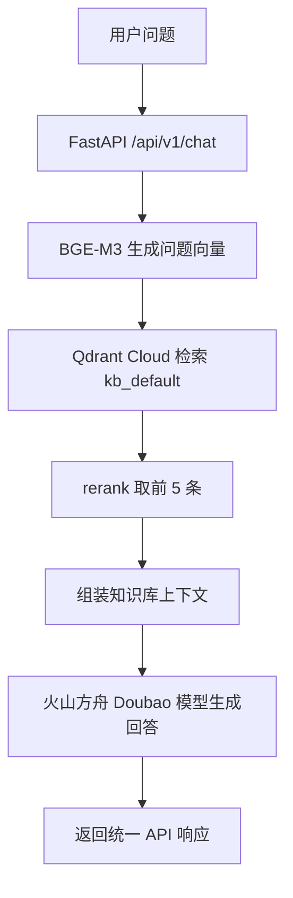

# 测试日志：南方剑兰是否需要分盆

## 1. 测试信息

- 测试时间：2026-06-26 16:34:20 +08:00
- 测试项目：`wechat_rag_bot`
- 测试问题：`去年冬开始养兰花是剑兰，我是南方，是否需要分盆`
- 测试方式：使用 FastAPI `TestClient` 调用真实配置下的 `/health` 和 `/api/v1/chat`。
- 编码处理：使用 Unicode 转义构造中文问题，避免 Windows PowerShell 管道将中文转成 `?`。

## 2. 真实配置

```text
LLM_PROVIDER=volcengine
LLM_MODEL=doubao-seed-1-6-flash-250615
EMBEDDING_PROVIDER=bge
EMBEDDING_MODEL=BAAI/bge-m3
QDRANT_COLLECTION=knowledge_chunks_bge_m3
CHUNK_STRATEGY=adaptive
RAG_TOP_K=20
RAG_TOP_N=5
```

## 3. 流程概览



## 4. 健康检查

请求：

```http
GET /health
```

结果：

```json
{
  "status_code": 200,
  "body": {
    "code": 0,
    "message": "success",
    "data": {
      "status": "ok"
    }
  }
}
```

结论：服务应用可正常加载。

## 5. 聊天接口测试

请求：

```http
POST /api/v1/chat
Authorization: Bearer change_me
Content-Type: application/json

{
  "channel": "api",
  "user_id": "real_config_test_user_divide_pot",
  "session_id": null,
  "message": "去年冬开始养兰花是剑兰，我是南方，是否需要分盆",
  "kb_id": "kb_default",
  "metadata": {
    "tenant_id": "tenant_default",
    "permission": "public"
  }
}
```

结果：

```json
{
  "status_code": 200,
  "body": {
    "code": 0,
    "message": "success",
    "data": {
      "answer": "知识库中没有找到明确答案。",
      "session_id": "sess_6a1ec5c94801498f817e350df2d3166c",
      "usage": {
        "completion_tokens": 54,
        "prompt_tokens": 1244,
        "total_tokens": 1298
      }
    }
  }
}
```

## 6. 命中来源

| 排名 | section | score |
| --- | --- | --- |
| 1 | CHUNK CARE-1133｜养护问答｜兰花分株繁殖的基础知识 | 0.70555097 |
| 2 | CHUNK CARE-1143｜养护问答｜如何判断兰花是否需要分株？ | 0.68704724 |
| 3 | CHUNK CARE-1168｜养护问答｜兰花爱好者在分株繁殖方面有哪些独特的经验和心得？ | 0.6716213 |
| 4 | CHUNK CARE-1134｜养护问答｜分株后的兰花如何养护？ | 0.6606815 |
| 5 | CHUNK CARE-1188｜养护问答｜阳台或天台空间有限时，如何合理安排翻盆分苗后的兰花布局？ | 0.6598313 |

## 7. 命中原文核对

命中 chunk 中包含以下可用信息：

- `CHUNK CARE-1133`：选择健壮母株，在合适季节（春秋为佳），小心分离出有完整根系、芦头和适当苗数的子株，处理好伤口后分别栽植。
- `CHUNK CARE-1143`：当盆内过于拥挤，兰苗数增多、根系满盆影响生长，或者有生长不良的弱苗时，可能需要分株。
- `CHUNK CARE-1168`：注重工具消毒，选准分株季节，小心分离避免伤根，分株后给予适宜温湿度和光照，耐心细致观察养护。
- `CHUNK CARE-1134`：分株后的兰花需置于阴凉通风处，控制浇水频率，避免施肥，待服盆后逐渐增加光照、正常浇水施肥。

## 8. 测试结论

- 技术链路：通过。健康检查、BGE embedding、Qdrant Cloud 检索、火山方舟 LLM 调用、统一响应均完成，HTTP 状态均为 200。
- 检索命中：基本通过。召回结果集中在“分株/分盆”主题，第一、第二命中均与问题核心相关。
- 回答结果：不通过。最终回答为“知识库中没有找到明确答案。”
- 主要原因：知识库命中了分株判断条件，但没有覆盖“去年冬开始养、南方、剑兰、是否现在需要分盆”这个具体组合的明确结论；系统提示词要求严格根据资料回答，模型因此选择兜底。
- 业务风险：对用户来说，这类问题更适合给条件式回复，例如“如果盆内拥挤、根系满盆或弱苗较多才考虑分盆；分株季节以春秋为佳；可先发盆面和根系照片判断”。当前模型没有把命中的条件组织成可执行建议。

## 9. 建议

1. 调整回答策略：当知识库给出判断条件但没有直接结论时，允许模型输出“需要看条件”的条件式回答，而不是直接兜底。
2. 增加知识库条目：补充“新手养了一个冬天是否分盆”“南方地区分盆季节”“剑兰/兰花品类澄清”相关 FAQ。
3. 改进提示词：要求模型在资料包含判断标准时，先给“不能直接判断”，再列出资料中的判断条件和下一步需要用户补充的信息。
