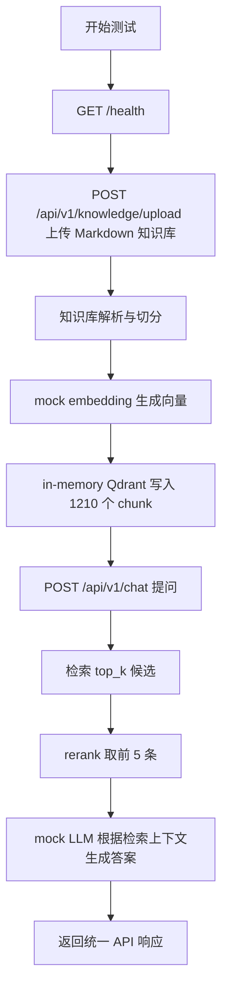

# 测试日志：怎么领取兰花资料

## 1. 测试信息

- 测试时间：2026-06-26 15:51:04 +08:00
- 测试项目：`wechat_rag_bot`
- 测试问题：`您好！怎么领取兰花资料`
- 测试方式：使用 FastAPI `TestClient` 在同一 Python 进程内完成健康检查、知识库上传、RAG 问答。
- 测试模式：
  - `API_AUTH_ENABLED=false`
  - `EMBEDDING_PROVIDER=mock`
  - `LLM_PROVIDER=mock`
  - `QDRANT_URL=`
  - `CHUNK_STRATEGY=adaptive`
  - `CHUNK_SIZE=1200`
  - `CHUNK_OVERLAP=100`

## 2. 流程概览



## 3. 实际执行步骤

### 3.1 健康检查

请求：

```http
GET /health
```

结果：

```json
{
  "status_code": 200,
  "body": {
    "code": 0,
    "message": "success",
    "data": {
      "status": "ok"
    }
  }
}
```

结论：服务应用可正常加载。

### 3.2 上传知识库

请求：

```http
POST /api/v1/knowledge/upload
Content-Type: multipart/form-data

file=data/uploads/doc_9345a487d4c4473baaada1ec4e45d04e.md
kb_id=kb_test_orchid_materials
tenant_id=tenant_test
permission=public
```

结果：

```json
{
  "status_code": 200,
  "body": {
    "code": 0,
    "message": "success",
    "data": {
      "doc_id": "doc_907c76cdea2b4114b27f23ee7721c33a",
      "file_name": "doc_9345a487d4c4473baaada1ec4e45d04e.md",
      "chunk_count": 1210,
      "status": "indexed"
    }
  }
}
```

结论：知识库上传、解析、切分、向量化和入库流程成功。

### 3.3 发起用户问题

请求：

```http
POST /api/v1/chat
Content-Type: application/json

{
  "channel": "api",
  "user_id": "test_user_001",
  "session_id": null,
  "message": "您好！怎么领取兰花资料",
  "kb_id": "kb_test_orchid_materials",
  "metadata": {
    "tenant_id": "tenant_test",
    "permission": "public"
  }
}
```

结果：

```json
{
  "status_code": 200,
  "body": {
    "code": 0,
    "message": "success",
    "data": {
      "answer": "## CHUNK SCRIPT-0290｜塑品｜基于L1客户 基于客户的产品需求及痛点，参考产品库L1人群对应产品，结合人群塑品维度和FABE法则组织有说服力的话术（L1重点塑品维度：好看...",
      "session_id": "sess_d37b3962146b4ac3b557aac73cf43bc0",
      "usage": {
        "prompt_tokens": 2235,
        "completion_tokens": 97
      }
    }
  }
}
```

命中来源前 5 条：

| 排名 | section | score |
| --- | --- | --- |
| 1 | CHUNK SCRIPT-0290｜塑品｜基于L1客户... | 0.14653361030824671 |
| 2 | CHUNK SCRIPT-0291｜塑品｜基于L1客户... | 0.14505454762049927 |
| 3 | CHUNK SCRIPT-0294｜塑品｜基于L1客户... | 0.14489330698071917 |
| 4 | CHUNK RULE-0006｜试成交阶段规则 | 0.1376919632708718 |
| 5 | CHUNK RULE-0011｜服务SOP阶段规则 | 0.1367568438714388 |

## 4. 相关知识库内容核对

知识库中确实存在与测试问题高度相关的内容，例如：

- `doc_9345a487d4c4473baaada1ec4e45d04e.md:282`：提到“提供养兰资料”“图文版资料”“免费领取”。
- `doc_9345a487d4c4473baaada1ec4e45d04e.md:342-346`：提到“电子版资料”“养兰基础版资料”“常见的烂根、焦尖、不开花”等内容。
- `doc_9345a487d4c4473baaada1ec4e45d04e.md:1776`：有“领资料是想学习呢还是想选择一株适合自己的草...”的话术。

## 5. 测试结论

- 技术链路：通过。健康检查、知识上传、切分入库、检索、重排、LLM 生成、统一响应均完成，HTTP 状态均为 200。
- 业务命中：不通过。用户问题是“怎么领取兰花资料”，但检索结果没有命中“电子版资料/免费领取/要资料”相关 chunk，最终回答偏到 L1 塑品话术。
- 主要原因判断：当前使用 `mock` embedding，它只是确定性的本地向量，不具备真实语义检索能力；rerank 当前也只是取检索结果前 `top_n`，没有纠偏能力。因此在大知识库下，语义相关内容存在但未被召回。

## 6. 真实配置复测

### 6.1 配置确认

复测时间：2026-06-26 16:06:58 +08:00

真实配置读取结果：

```text
LLM_PROVIDER=volcengine
LLM_MODEL=doubao-seed-1-6-flash-250615
EMBEDDING_PROVIDER=bge
EMBEDDING_MODEL=BAAI/bge-m3
QDRANT_COLLECTION=knowledge_chunks_bge_m3
```

说明：

- `.env` 中原先写的是 `LLM_PROVIDER=deepseek` 和 `LLM_MODEL=deepseek-chat`，但 API key 实际是火山引擎方舟 key。
- 已将 provider 配置为 `volcengine`。
- 通过火山 `/api/v3/models` 查询确认 `deepseek-chat` 不存在或无权限。
- 账号当前可调用模型中，`doubao-seed-1-6-flash-250615` 调用成功，因此已配置为真实可用模型。

LLM 轻量连通性验证：

```text
provider=volcengine
model=doubao-seed-1-6-flash-250615
status=success
answer=ok
```

### 6.2 真实 RAG 问答

请求：

```http
POST /api/v1/chat
Authorization: Bearer change_me
Content-Type: application/json

{
  "channel": "api",
  "user_id": "real_config_test_user",
  "session_id": null,
  "message": "您好！怎么领取兰花资料",
  "kb_id": "kb_default",
  "metadata": {
    "tenant_id": "tenant_default",
    "permission": "public"
  }
}
```

结果：

```json
{
  "status_code": 200,
  "code": 0,
  "message": "success",
  "data": {
    "answer": "知识库中没有找到明确答案。",
    "session_id": "sess_fba00b5312fa432eaa634837096a778f",
    "usage": {
      "completion_tokens": 45,
      "prompt_tokens": 1764,
      "total_tokens": 1809
    }
  }
}
```

命中来源前 5 条：

| 排名 | section | score |
| --- | --- | --- |
| 1 | CHUNK SCRIPT-0216｜找痛点｜基于L3客户... | 0.44714865 |
| 2 | CHUNK SCRIPT-0219｜找痛点｜基于L3客户... | 0.4458863 |
| 3 | CHUNK SCRIPT-0222｜找痛点｜基于L3客户... | 0.4455281 |
| 4 | CHUNK SCRIPT-0226｜找痛点｜基于L3客户... | 0.44249493 |
| 5 | CHUNK SCRIPT-0225｜找痛点｜基于L3客户... | 0.442253 |

### 6.3 真实配置结论

- 技术链路：通过。真实 BGE embedding、Qdrant Cloud、火山方舟 LLM 均被调用成功，`/api/v1/chat` 返回 HTTP 200。
- 业务命中：不通过。真实检索仍未命中“电子版资料/免费领取/要资料/领取资料”相关 chunk，而是召回 L3 找痛点话术。
- 结果表现：因为召回上下文与问题不匹配，火山模型遵守提示词约束，回答了“知识库中没有找到明确答案。”
- 当前主要问题已经不是 LLM 配置，而是检索召回/重排策略：真实 embedding 下也没有把“怎么领取兰花资料”召回到正确资料段落。

### 6.4 中文编码修正后复测

排查发现：Windows PowerShell here-string 通过管道传给 `python -` 时，中文测试问题会被转成问号。

验证命令输出：

```text
repr("您好！怎么领取兰花资料") => '???????????'
```

因此 6.2 的真实 RAG 问答实际发送给服务的问题不是中文，而是 `???????????`。这会直接导致 embedding 查询向量错误，进而召回无关 chunk。

改用 Unicode 转义构造同一个中文问题后，服务端日志确认收到原始问题：

```text
question='您好！怎么领取兰花资料'
```

修正后真实 RAG 结果：

```json
{
  "status_code": 200,
  "code": 0,
  "message": "success",
  "data": {
    "answer": "兰友我们家是通过理论+实操的方法教大家把兰花养好的，我们分发的是电子版资料，里面汇总了兰友常见养兰问题，并且不断更新让大家学习。资料只是我们指导大家养兰的...\n来源：私域销售首单推进_AI客服知识库.md"
  }
}
```

修正后命中来源前 5 条：

| 排名 | section | score |
| --- | --- | --- |
| 1 | CHUNK FAQ-0533｜常见问题｜已购兰友问纸质资料在哪里领？ | 0.756177 |
| 2 | CHUNK FAQ-0532｜常见问题｜抖音主播说的有资料和我买的兰花一并寄给我吗 | 0.6922377 |
| 3 | CHUNK FAQ-0538｜常见问题｜抖音主播说的有资料和我买的兰花一并寄给我吗 | 0.68184453 |
| 4 | CHUNK SCRIPT-0093｜破冰｜首次接待兰园介绍并且获取标签信息 | 0.68162656 |
| 5 | CHUNK SCRIPT-0094｜破冰｜首次接待兰园介绍并且获取标签信息 | 0.67404497 |

修正后结论：

- 原先“真实配置未命中”的主要原因是测试脚本输入编码错误。
- 使用正确中文输入后，真实 BGE + Qdrant 已经可以召回“资料领取/纸质资料/电子版资料”相关 chunk。
- 仍需注意：当前回答里有省略号，说明知识库 chunk 本身可能包含被截断的内容，后续可继续检查入库文档是否已经带有省略号，或 chunk 内容是否需要更完整。

## 7. 建议

1. 使用真实 embedding provider 重新测试，例如 `bge` 或 OpenAI-compatible embedding。
2. 增加针对“要资料/领取资料/兰花资料/怎么领取”的关键词或混合检索策略。
3. 为这条问题补一条固定回归用例，断言来源中至少包含“电子版资料”“免费领取”或“要资料”相关 section。
4. 若继续使用 mock 模式做本地演示，应明确它只能验证接口链路，不能验证语义检索质量。
