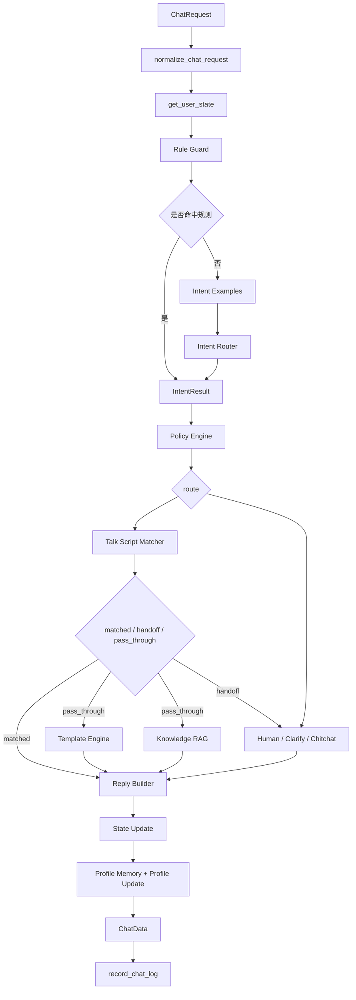
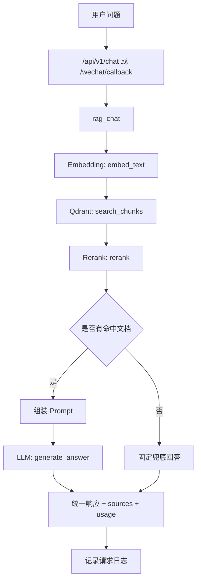
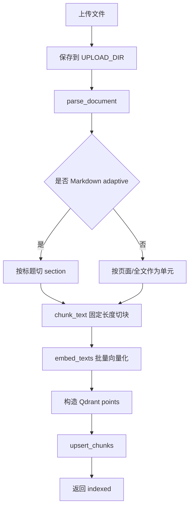

# 后端接口与核心逻辑骨架

本文档基于当前项目已有代码整理，用于后续修改后端接口、RAG 主流程、知识库入库流程和微信接入逻辑。

当前后端项目位于 `wechat_rag_bot/`，技术栈为 FastAPI + Pydantic Settings + SQLAlchemy + SQLite + Qdrant + LLM/Embedding Provider。

> 注意：当前源码中的部分中文提示文本存在编码异常。本文按代码意图整理中文说明，实际返回文案以后建议单独统一修正。

## 1. 项目后端结构

```text
wechat_rag_bot/
  app/
    main.py                  # FastAPI 应用入口、路由注册、统一异常响应、健康检查
    config.py                # 环境变量配置
    routers/
      chat.py                # 统一聊天接口 /api/v1/chat
      knowledge.py           # 知识库上传接口 /api/v1/knowledge/upload
      templates.py           # 模板创建与搜索接口
      intent_examples.py     # 意图样本接口
      state.py               # 用户状态接口
      user_profile.py        # 用户画像、聊天记忆、画像事件接口
      debug.py               # 调试接口
      admin_logs.py          # 客服 AI 日志与质检接口
      wechat.py              # 微信回调接口 /wechat/callback
    services/
      chat_orchestrator.py   # 统一聊天编排主流程
      channel_service.py     # API/微信消息归一化
      rule_guard_service.py  # 规则优先拦截
      intent_service.py      # 意图识别
      intent_example_service.py # 意图样本召回
      policy_service.py      # 路由决策
      talk_script/           # 兰花确定性话术库：Excel 导入、scene/question 匹配、固定话术输出、命中日志
      template_service.py    # 模板选择与渲染
      reply_builder.py       # 最终回复组装
      state_service.py       # 用户状态读写
      user_profile_service.py # 用户画像、聊天记忆、画像事件读写
      chat_log_service.py    # 聊天日志写入、查询、统计、脱敏
      rag_service.py         # RAG 主流程
      knowledge_service.py   # 文档解析、分块、入库
      embedding_service.py   # Embedding 生成
      qdrant_service.py      # Qdrant 写入与检索
      rerank_service.py      # 重排占位逻辑
      llm_service.py         # LLM 生成回答
      wechat_service.py      # 微信签名、XML 解析、XML 回复、消息去重
    schemas/
      chat.py                # 聊天请求、聊天响应、统一响应
      common.py              # 错误码、业务异常
      knowledge.py           # 知识库上传响应结构
      event.py               # 归一化消息
      intent.py              # 意图结果
      policy.py              # 策略决策
      reply.py               # 最终回复
      state.py               # 用户状态
      template.py            # 模板与模板回复
      log.py                 # 客服 AI 日志响应结构
    utils/
      auth.py                # Bearer API Key 鉴权
      ids.py                 # 业务 ID 生成
      logger.py              # JSON 日志
      time.py                # 上海时区时间工具
    db/
      session.py             # SQLAlchemy session factory，占位
      models.py              # SQLAlchemy Base、ChatLogModel、UserProfileModel、ConversationMemoryModel、ProfileEventModel
```

## 2. 应用入口

文件：`wechat_rag_bot/app/main.py`

固定逻辑：

1. 初始化日志。
2. 创建 FastAPI 应用，标题来自 `APP_NAME`。
3. 注册 router：
   - `chat.router`
   - `knowledge.router`
   - `templates.router`
   - `intent_examples.router`
   - `user_profile.router`
   - `state.router`
   - `debug.router`
   - `admin_logs.router`
   - `wechat.router`
4. 注册统一异常处理：
   - `AppError`
   - `RequestValidationError`
   - `StarletteHTTPException`
   - 未捕获 `Exception`
5. 暴露健康检查接口 `/health`。

统一 JSON 响应格式：

```json
{
  "code": 0,
  "message": "success",
  "data": {}
}
```

异常响应也保持同样 envelope：

```json
{
  "code": 40000,
  "message": "请求参数错误",
  "data": null
}
```

## 3. 已有接口清单

### 3.1 健康检查

```http
GET /health
```

鉴权：无。

返回：

```json
{
  "code": 0,
  "message": "success",
  "data": {
    "status": "ok"
  }
}
```

### 3.2 统一聊天接口

```http
POST /api/v1/chat
Authorization: Bearer <API_KEY>
Content-Type: application/json
```

文件：`wechat_rag_bot/app/routers/chat.py`

请求体：

```json
{
  "channel": "api",
  "user_id": "user_001",
  "session_id": null,
  "message": "用户问题",
  "kb_id": "kb_default",
  "metadata": {
    "tenant_id": "tenant_default",
    "permission": "public"
  }
}
```

字段说明：

| 字段 | 类型 | 必填 | 说明 |
| --- | --- | --- | --- |
| `channel` | string | 是 | 来源渠道，例如 `api`、`wechat` |
| `user_id` | string | 是 | 用户 ID |
| `session_id` | string/null | 否 | 会话 ID；为空时自动生成 |
| `message` | string | 是 | 用户问题 |
| `kb_id` | string | 是 | 知识库 ID |
| `metadata` | object | 否 | 扩展字段，当前用于 `tenant_id`、`permission` |

处理逻辑：

```text
HTTP 请求
  -> require_api_key 鉴权
  -> ChatRequest 校验
  -> handle_chat(...)
  -> ChatData 校验
  -> APIResponse(code=0, message="success", data=...)
```

成功响应：

```json
{
  "code": 0,
  "message": "success",
  "data": {
    "answer": "回答内容",
    "session_id": "sess_xxx",
    "sources": [
      {
        "doc_id": "doc_xxx",
        "file_name": "xxx.pdf",
        "page": 1,
        "section": null,
        "score": 0.88
      }
    ],
    "usage": {
      "prompt_tokens": 0,
      "completion_tokens": 0
    },
    "reply_type": "template",
    "route": "template_reply",
    "intent": {},
    "template": {},
    "need_human": false,
    "next_action": null,
    "trace_id": "req_xxx",
    "metadata": {},
    "handoff": null
  }
}
```

旧兼容字段为 `answer`、`session_id`、`sources`、`usage`；路由、意图、模板、人工标记、`trace_id`、`metadata` 和 `handoff` 为新增观察字段。

转人工场景的响应约定：

```json
{
  "code": 0,
  "message": "success",
  "data": {
    "answer": "",
    "session_id": "sess_xxx",
    "sources": [],
    "usage": {},
    "reply_type": "human",
    "route": "human",
    "intent": {},
    "template": {},
    "need_human": true,
    "next_action": "human_handoff",
    "trace_id": "req_xxx",
    "metadata": {
      "handoff": {
        "ticket_id": "handoff_xxx",
        "status": "pending",
        "reason": "rag_no_answer_to_handoff"
      },
      "original_route": "rag_answer"
    },
    "handoff": {
      "ticket_id": "handoff_xxx",
      "status": "pending",
      "reason": "rag_no_answer"
    }
  }
}
```

`metadata.handoff.reason` 保留内部完整原因；顶层 `handoff.reason` 兼容早期测试和调用方的短原因命名。

### 3.3 知识库上传接口

```http
POST /api/v1/knowledge/upload
Authorization: Bearer <API_KEY>
Content-Type: multipart/form-data
```

文件：`wechat_rag_bot/app/routers/knowledge.py`

表单字段：

| 字段 | 类型 | 必填 | 默认值 | 说明 |
| --- | --- | --- | --- | --- |
| `file` | file | 是 | 无 | 上传文件 |
| `kb_id` | string | 是 | 无 | 知识库 ID |
| `tenant_id` | string | 是 | 无 | 租户 ID |
| `permission` | string | 否 | `public` | 权限标识 |

支持文件后缀：

```text
.txt
.md
.pdf
```

处理逻辑：

```text
HTTP 上传
  -> require_api_key 鉴权
  -> 清理原始文件名
  -> 校验文件后缀
  -> 保存到 UPLOAD_DIR
  -> index_document(...)
  -> 返回入库结果
```

成功响应：

```json
{
  "code": 0,
  "message": "success",
  "data": {
    "doc_id": "doc_xxx",
    "file_name": "原始文件名.pdf",
    "chunk_count": 12,
    "status": "indexed"
  }
}
```

### 3.4 模板、意图样本、状态与调试接口

这些接口都使用 Bearer API Key 鉴权，并返回 `code/message/data` envelope。

| 接口 | 说明 |
| --- | --- |
| `POST /api/v1/templates` | 创建或更新内存模板 |
| `POST /api/v1/templates/search` | 按消息、意图、阶段、标签搜索模板 |
| `POST /api/v1/intent-examples` | 写入意图样本 |
| `GET /api/v1/users/{user_id}/state` | 查询用户状态 |
| `PATCH /api/v1/users/{user_id}/state` | 更新用户状态 |
| `POST /api/v1/debug/intent` | 调试意图识别、策略路由和候选样本 |

第一阶段模板、意图样本和状态均为进程内存实现，后续可替换为 Qdrant、Redis 或 PostgreSQL。

### 3.5 用户画像、聊天记忆与画像事件接口

文件：`wechat_rag_bot/app/routers/user_profile.py`

新增用户画像接口不会替代旧 `/api/v1/users/{user_id}/state`。旧 state API 继续作为轻量运行态状态接口保留；profile API 用于后台、debug、人工客服工作台和运营系统查看、维护完整用户画像。

全部接口必须使用 Bearer API Key 鉴权，并返回统一 `code/message/data` envelope。

| 接口 | 说明 |
| --- | --- |
| `GET /api/v1/users/{user_id}/profile` | 查询用户完整画像；首次访问时自动创建空画像 |
| `PATCH /api/v1/users/{user_id}/profile` | 手动维护用户画像，并写入 `profile_events` |
| `GET /api/v1/users/{user_id}/memories?limit=10` | 查询用户最近聊天记忆，默认 10，最大 50 |
| `GET /api/v1/users/{user_id}/profile/events?limit=20` | 查询画像变化事件，默认 20，最大 100 |

用户身份定位规则：

```text
/api/v1/chat 请求中的 user_id
  -> user_profiles.user_id
  -> /api/v1/users/{user_id}/profile
```

联调时同一个真实客户必须稳定传同一个 `user_id`。`session_id` 只表示一次会话，不作为画像主键；`trace_id` 只用于单次请求排查；`tenant_id` 默认为 `tenant_default`，用于租户/项目隔离预留。

首次创建画像的默认值：

```json
{
  "tenant_id": "tenant_default",
  "channel": "api",
  "current_stage": "unknown",
  "risk_level": "normal",
  "is_human_handoff": false,
  "customer_tags": [],
  "product_interests": [],
  "pain_points": []
}
```

`PATCH /profile` 允许更新字段：

```text
current_stage, risk_level, customer_tags, product_interests,
ai_summary, preference_summary, pain_points,
is_human_handoff, human_ticket_id, human_handoff_status,
human_handoff_reason
```

`user_id`、`tenant_id`、`created_at` 不允许通过 PATCH 覆盖。每次 PATCH 如果产生字段变化，会写入 `profile_events`：

```text
event_type = profile_patched
before_json = 变更前字段
after_json = 变更后字段
reason = metadata.reason 或 manual_patch
```

聊天记忆返回 `items` 按最近窗口内从旧到新排序，方便前端直接渲染对话。`/api/v1/chat` 成功处理后会写入：

```text
append_conversation_memory(role="user")
append_conversation_memory(role="assistant")  # answer 非空时
update_profile_after_chat
```

当路由为 `human` 或 `reply.need_human=true` 时，会标记转人工画像字段，并写入：

```text
event_type = handoff_created
is_human_handoff = true
human_ticket_id = reply.metadata.handoff.ticket_id
human_handoff_status = pending
human_handoff_reason = reply.metadata.handoff.reason 或 intent.reason 或 human_route
```

### 3.6 客服 AI 日志与质检接口

文件：`wechat_rag_bot/app/routers/admin_logs.py`

全部接口路径位于 `/api/v1/admin/...` 下，必须使用 Bearer API Key 鉴权。

| 接口 | 说明 |
| --- | --- |
| `GET /api/v1/admin/chat-logs` | 分页查询聊天日志，支持过滤和关键词搜索 |
| `GET /api/v1/admin/chat-logs/{trace_id}` | 查询单条日志详情 |
| `GET /api/v1/admin/chat-log-stats` | 查询日志统计 |

日志列表支持过滤字段：

```text
page, page_size, user_id, session_id, route, primary_intent,
template_id, status, need_human, keyword, start_time, end_time
```

缺失 `trace_id` 时返回统一错误：

```json
{
  "code": 40000,
  "message": "日志不存在",
  "data": null
}
```

### 3.7 微信服务器验证接口

```http
GET /wechat/callback?signature=...&timestamp=...&nonce=...&echostr=...
```

文件：`wechat_rag_bot/app/routers/wechat.py`

鉴权：微信签名校验，不使用 Bearer API Key。

处理逻辑：

```text
接收 signature/timestamp/nonce/echostr
  -> verify_signature(WECHAT_TOKEN, signature, timestamp, nonce)
  -> 成功：返回 echostr 纯文本
  -> 失败：返回 403 Forbidden
```

### 3.8 微信消息回调接口

```http
POST /wechat/callback?signature=...&timestamp=...&nonce=...
Content-Type: application/xml
```

文件：`wechat_rag_bot/app/routers/wechat.py`

鉴权：微信签名校验，不使用 Bearer API Key。

处理逻辑：

```text
微信 XML 消息
  -> verify_signature(...)
  -> parse_message(...)
  -> 根据 MsgId 做内存去重
  -> 非文本消息：回复“当前仅支持文本问题”
  -> 文本消息：
       构造 ChatRequest
       handle_chat(request)
  -> build_text_reply(...)
  -> 缓存 MsgId 对应回复
  -> 返回 XML
```

返回：微信 XML 文本消息。

## 4. 鉴权框架

文件：`wechat_rag_bot/app/utils/auth.py`

当前业务 API 使用 Bearer Token：

```http
Authorization: Bearer <API_KEY>
```

固定逻辑：

```text
API_AUTH_ENABLED=false
  -> 跳过鉴权

API_AUTH_ENABLED=true
  -> 缺少 Authorization：抛 UNAUTHENTICATED，HTTP 401
  -> scheme 不是 bearer 或 token 不等于 API_KEY：抛 INVALID_API_KEY，HTTP 401
```

目前应用 Bearer 鉴权的接口：

- `POST /api/v1/chat`
- `POST /api/v1/knowledge/upload`
- `POST /api/v1/templates`
- `POST /api/v1/templates/search`
- `POST /api/v1/intent-examples`
- `GET/PATCH /api/v1/users/{user_id}/state`
- `GET /api/v1/users/{user_id}/profile`
- `PATCH /api/v1/users/{user_id}/profile`
- `GET /api/v1/users/{user_id}/memories`
- `GET /api/v1/users/{user_id}/profile/events`
- `POST /api/v1/debug/intent`
- `GET /api/v1/admin/chat-logs`
- `GET /api/v1/admin/chat-logs/{trace_id}`
- `GET /api/v1/admin/chat-log-stats`

微信接口走微信签名校验。

## 5. 统一聊天编排主流程

文件：`wechat_rag_bot/app/services/chat_orchestrator.py`

入口函数：

```python
async def handle_chat(request: ChatRequest) -> dict:
```

核心流程：

```text
handle_chat
  -> normalize_chat_request
  -> get_user_state
  -> check_rules
  -> retrieve_intent_examples
  -> classify_intent
  -> decide_route
  -> _build_reply
       template_reply / rag_answer / template_then_rag:
         先尝试 talk_script_matcher
           matched: 返回 template_library.answer_default，不走 RAG
           handoff: answer=""，need_human=true，next_action=human_handoff
           pass_through: 继续原路线
       template_reply: select_template -> render_template -> build_template_reply
         模板未命中: build_handoff_reply(reason=template_not_found_to_handoff)
       rag_answer: answer_knowledge -> build_rag_reply
         RAG 无答案/无 sources/空 answer: build_handoff_reply(reason=rag_no_answer_to_handoff)
       template_then_rag: template + rag -> build_template_then_rag_reply
         模板缺失或 RAG 无答案: build_handoff_reply(...)
       human: build_handoff_reply(...)
       chitchat: 固定寒暄回复
       unsupported / clarify: 当前 MVP 由 policy 转为 human，不在回复层生成普通话术
  -> update_user_state
  -> append_conversation_memory(role="user")
  -> append_conversation_memory(role="assistant")  # answer 非空时
  -> update_profile_after_chat
  -> 返回 ChatData 兼容结构
  -> finally record_chat_log
```

阶段耗时写入 `stage_latencies`：

```text
normalize_ms, state_ms, rule_guard_ms, intent_examples_ms,
intent_ms, policy_ms, talk_script_ms, template_ms, rag_ms, reply_build_ms,
state_update_ms
```

失败路径会尽量记录 `trace_id`、`channel`、`user_id`、`session_id`、`user_message`、已得到的 `intent/route/reply`、`error_code`、`error_message`。日志写入失败只记录内部错误，不影响聊天主流程。

统一转人工由 `chat_orchestrator.build_handoff_reply(...)` 负责，内部调用 `app/talk_script/human_handoff_service.py::request_human_handoff(...)`。当前人工系统为 mock/预留实现，但主流程会生成 `handoff_xxx` 工单 ID，并写入回复 `metadata.handoff`、用户画像和聊天日志。

统一聊天流程图：



### 5.1 意图识别 1.0

文件：`wechat_rag_bot/app/services/intent_service.py`

模块边界：意图识别只输出结构化 `IntentResult`，不生成用户回复，不直接调用模板、RAG 或人工系统。当前版本规则优先，意图样本仅用于辅助增强置信度，LLM JSON 分类为低置信预留能力，默认关闭。

核心函数：

```python
def normalize_intent_text(text: str) -> str
def hit_any(text: str, words: tuple[str, ...]) -> bool
def classify_by_rules(text: str) -> IntentResult | None
async def classify_by_llm(message, user_state, candidates=None) -> IntentResult
async def classify_intent(message, user_state, candidates=None) -> IntentResult
```

7 类 route：

| route | 典型场景 | 后续流程 |
| --- | --- | --- |
| `human` | 人工、退款、投诉、强烈不满 | 直接转人工 |
| `template_reply` | 价格、优惠、嫌贵、物流、下单、付款 | 先固定话术库，再模板 |
| `rag_answer` | 知识、流程、方法、资料、说明类问题 | 先固定话术库，再 RAG |
| `template_then_rag` | 销售顾虑 + 知识担忧 | 模板和 RAG 都可用时组合回复 |
| `chitchat` | 你好、在吗、谢谢 | 固定寒暄回复 |
| `clarify` | 表达不清或规则低置信 | MVP 阶段转人工 |
| `unsupported` | 明显不支持或业务外 | MVP 阶段转人工 |

优先级：

```text
P0 空消息 -> MESSAGE_EMPTY
P1 人工/退款/投诉/风险 -> human
P2 价格顾虑 + 知识担忧 -> template_then_rag
P3 销售/交易类 -> template_reply
P4 知识/流程/方法类 -> rag_answer
P5 寒暄 -> chitchat
P6 不明确 -> clarify
P7 明显不支持/业务外 -> unsupported
```

`human` 永远最高优先级。例如“我要退款，怎么处理？”必须识别为 `human/refund_request`，不能因为包含“怎么处理”而进入 `rag_answer`。

`IntentResult` 至少包含：

```text
route, primary_intent, secondary_intents, sales_stage,
confidence, need_template, need_rag, need_human,
slots, reason
```

当前主要 `primary_intent`：

```text
greeting, ask_price, price_objection, discount_request,
ask_logistics, ask_after_sale, order_intent, payment_intent,
knowledge_question, care_question, process_question, usage_question,
refund_request, complaint, human_request, unsupported, unknown
```

所有意图结果都会经 `IntentResult.model_validate(...)` 校验，失败抛 `INTENT_SCHEMA_INVALID`。

### 5.2 Policy Engine MVP 兜底策略

文件：`wechat_rag_bot/app/services/policy_service.py`

当前 MVP 原则：先保证不乱答。只要系统不能确定性自动处理，就统一转人工。

裁决规则：

```text
need_human=true -> human
primary_intent in complaint/refund_request/human_request -> human
intent.route == human -> human
intent.route == clarify -> human, reason=clarify_to_handoff
intent.route == unsupported -> human, reason=unsupported_to_handoff
confidence < INTENT_CONFIDENCE_THRESHOLD -> human, reason=low_confidence_to_handoff
knowledge/care/process/usage -> rag_answer
price/logistics/order/payment/after_sale -> template_reply
price_objection + care_question/knowledge_question -> template_then_rag
chitchat -> chitchat
```

`PolicyDecision` 字段：

```text
route, allowed, reason, fallback_route, original_route, next_action
```

当 policy 把 `clarify`、`unsupported` 或低置信意图裁决为 `human` 时，`original_route` 会保留原始 route，`next_action="human_handoff"`，供回复、日志和画像追踪。

### 5.3 转人工统一行为

所有转人工场景统一返回：

```text
answer = ""
reply_type = "human"
route = "human"
need_human = true
next_action = "human_handoff"
metadata.handoff.ticket_id = "handoff_xxx"
metadata.handoff.status = "pending"
metadata.handoff.reason = 内部原因
metadata.original_route = 原始 route
```

触发转人工的场景：

| 场景 | reason | original_route |
| --- | --- | --- |
| 明确人工/退款/投诉 | `human_required` 或规则原因 | `human` |
| 表达不清 | `clarify_to_handoff` | `clarify` |
| 明显不支持 | `unsupported_to_handoff` | `unsupported` |
| 低置信 | `low_confidence_to_handoff` | 原始 route |
| RAG 无 sources、空 answer 或默认无答案文案 | `rag_no_answer_to_handoff` | `rag_answer` 或 `template_then_rag` |
| 模板未命中 | `template_not_found_to_handoff` | `template_reply` 或 `template_then_rag` |
| 固定话术库要求人工 | 话术库返回原因或 `talk_script_to_handoff` | 原始 route |

转人工后用户画像更新：

```text
is_human_handoff = true
human_ticket_id = metadata.handoff.ticket_id
human_handoff_status = pending
human_handoff_reason = metadata.handoff.reason
profile_events.event_type = handoff_created
```

聊天记忆仍写入用户消息；`answer=""` 时不写 assistant 空消息。

## 6. 确定性话术库匹配模块

文件目录：`wechat_rag_bot/app/talk_script/`

定位：兰花私域确定性话术库是意图识别之后的高优先级执行模块，不替代 `intent_service`。当 `policy_service` 决定路线为 `template_reply`、`template_then_rag` 或 `rag_answer` 时，`chat_orchestrator._build_reply` 会先尝试 `match_talk_script(...)`。只要高置信命中固定话术，就直接返回 Excel 中 `template_library.answer_default`，不会进入 RAG，也不会让 LLM 自由生成客服回复。

核心数据表：

| 表 | 说明 |
| --- | --- |
| `scene_index` | 一级场景索引，字段包括 `scene_id`、`scene_name`、`enter_conditions`、`typical_user_messages`、`exclude_conditions`、`priority`、`status` |
| `question_cluster` | 标准问题簇，字段包括 `question_id`、`scene_id`、正反例、关键词、`default_template_id`、置信度阈值、优先级、状态 |
| `template_library` | 固定话术库，最终用户可见回答只取 `answer_default` |
| `talk_script_match_logs` | 话术匹配明细子表，通过 `trace_id`、`customer_id`、`session_id` 与主聊天日志关联 |

导入命令：

```bash
cd wechat_rag_bot
python -m app.scripts.import_talk_scripts "C:/Users/32456/Downloads/兰花私域MVP确定性话术库_优化版.xlsx"
```

Excel 导入校验：

```text
scene_id / question_id / template_id 唯一
question_cluster.scene_id 必须存在于 scene_index
question_cluster.default_template_id 必须存在于 template_library
template_library.question_id 必须存在于 question_cluster
status 只能是 active / disabled / need_review，其中 scene_index 只允许 active / disabled
answer_default、default_template_id 不能为空
每个 active question_id 必须有 active template
```

运行链路：

```text
match_talk_script
  -> normalize_message
  -> match_scene
  -> retrieve_candidate_questions(scene_id, max 5)
  -> llm_question_classifier
       真实环境：调用 llm_service.generate_json(purpose="talk_script")
       模型选择：TALK_SCRIPT_LLM_* -> INTENT_LLM_* -> LLM_*
       mock 环境：本地候选打分，便于测试
  -> 根据 question_id 查 default_template_id
  -> 返回 template_library.answer_default
  -> record_match_log 写入 talk_script_match_logs
```

返回状态：

| 状态 | 含义 | 主流程行为 |
| --- | --- | --- |
| `matched` | 高置信命中固定话术 | 返回 `answer_default`，不走 RAG |
| `handoff` | 进入话术库范围但低置信、信息不足、高风险或需要人工 | 调用预留 `human_handoff_service`，`answer=""`，`need_human=true` |
| `pass_through` | 不属于固定话术库范围 | 继续原 `template_service` 或 `rag_service` 路线 |

人工转接接口预留在 `app/talk_script/human_handoff_service.py`。当前实现只返回 `requested=true/status=pending`，后续可接企业微信、飞书、短信或内部工单通知。

聊天主日志仍由 `chat_log_service` 写入 `chat_logs`。固定话术命中摘要放入主日志 `metadata.talk_script`，完整候选、置信度、原因和转人工信息放入 `talk_script_match_logs`。

## 7. RAG 主流程

文件：`wechat_rag_bot/app/services/rag_service.py`

入口函数：

```python
async def rag_chat(
    user_id: str,
    message: str,
    kb_id: str,
    session_id: str | None = None,
    channel: str = "api",
    metadata: dict | None = None,
) -> dict:
```

核心固定流程：

```text
rag_chat
  -> 生成 request_id
  -> session_id 为空则生成 sess_xxx
  -> 校验 message 非空
  -> embed_text(message)
  -> search_chunks(
       vector,
       kb_id=kb_id,
       tenant_id=metadata.tenant_id 或 tenant_default,
       permission=metadata.permission 或 public,
       top_k=RAG_TOP_K
     )
  -> rerank(question, candidates, RAG_TOP_N)
  -> sources = 提取 doc_id/file_name/page/section/score
  -> 如果 docs 非空：
       使用 PROMPT_TEMPLATE 组装 context + question
       generate_answer(prompt)
     否则：
       返回“知识库中没有找到明确答案”
  -> 返回 answer/sources/session_id/usage
  -> finally 记录 JSON 日志
```

RAG 流程图：



返回数据骨架：

```json
{
  "answer": "string",
  "sources": [],
  "session_id": "sess_xxx",
  "usage": {}
}
```

日志字段：

```json
{
  "request_id": "req_xxx",
  "channel": "api",
  "user_id": "user_001",
  "session_id": "sess_xxx",
  "kb_id": "kb_default",
  "question": "用户问题",
  "answer": "回答",
  "sources": [],
  "latency_ms": 123,
  "status": "success",
  "created_at": "Asia/Shanghai ISO 时间"
}
```

## 8. 客服 AI 日志服务

文件：`wechat_rag_bot/app/services/chat_log_service.py`

核心函数：

```python
def sanitize_log_payload(payload: dict) -> dict

async def record_chat_log(log: dict) -> None

async def list_chat_logs(...) -> dict

async def get_chat_log(trace_id: str) -> dict | None

async def get_chat_log_stats(...) -> dict
```

存储模型：`wechat_rag_bot/app/db/models.py::ChatLogModel`

第一版使用 `CHAT_LOG_DB_URL=sqlite:///./chat_logs.db` 单独存储日志。服务懒加载 SQLAlchemy engine 并自动创建 `chat_logs` 表。JSON 字段使用 text 存储，包括 `secondary_intents_json`、`sources_json`、`usage_json`、`stage_latencies_json`、`metadata_json`。

隐私规则：

- 不记录 API Key、微信 AppSecret、Qdrant API Key、Authorization header。
- `metadata` 递归过滤 `token`、`password`、`api_key`、`secret`、`authorization`。
- `user_message` 和 `answer` 按配置限制最大长度。

统计字段：

```text
total, success_count, failed_count, avg_latency_ms,
route_counts, intent_counts, template_counts,
human_count, rag_count, template_count
```

## 8.5 用户画像服务

文件：`wechat_rag_bot/app/services/user_profile_service.py`

核心函数：

```python
async def get_profile_bundle(user_id: str) -> dict

async def patch_user_profile(user_id: str, updates: dict) -> dict

async def get_recent_memories(user_id: str, limit: int = 10) -> dict

async def get_profile_events(user_id: str, limit: int = 20) -> dict

async def append_conversation_memory(...) -> None

async def update_profile_after_chat(message, intent, reply) -> None
```

存储模型：`wechat_rag_bot/app/db/models.py`

| 表 | 说明 |
| --- | --- |
| `user_profiles` | 用户完整画像，主键为 `user_id` |
| `conversation_memories` | 聊天记忆，一轮聊天通常写入 user 和 assistant 两条 |
| `profile_events` | 画像变化审计事件，记录 before/after/reason/trace_id |

第一版画像表使用 `DATABASE_URL` 对应的 SQLite/SQLAlchemy engine，并在服务首次访问时自动创建 `user_profiles`、`conversation_memories`、`profile_events`。JSON 列表字段使用 text 存储，包括 `customer_tags_json`、`product_interests_json`、`pain_points_json`、`before_json`、`after_json`。

画像字段骨架：

```json
{
  "user_id": "user_001",
  "tenant_id": "tenant_default",
  "channel": "api",
  "current_stage": "unknown",
  "risk_level": "normal",
  "is_human_handoff": false,
  "human_ticket_id": null,
  "human_handoff_status": null,
  "human_handoff_reason": null,
  "customer_tags": [],
  "product_interests": [],
  "ai_summary": null,
  "preference_summary": null,
  "pain_points": [],
  "last_intent": null,
  "last_route": null,
  "last_template_id": null,
  "last_active_at": null,
  "created_at": "ISO datetime",
  "updated_at": "ISO datetime"
}
```

数据接入路径固定为三类：

```text
A. 聊天自动写入
/api/v1/chat
  -> handle_chat
  -> append_conversation_memory(role="user")
  -> append_conversation_memory(role="assistant")
  -> update_profile_after_chat

B. 后台/API 手动维护
PATCH /api/v1/users/{user_id}/profile
  -> patch_user_profile
  -> profile_events(event_type="profile_patched")

C. 转人工写入
route = human 或 need_human = true
  -> update_profile_after_chat
  -> profile_events(event_type="handoff_created")
```

当前画像主键是 `user_id`。真实渠道联调时建议按渠道稳定映射：

| 渠道 | 建议传入 `user_id` |
| --- | --- |
| 微信公众号 | `openid` |
| 小程序/多端打通 | 优先 `unionid` |
| 自有 App/CRM | 内部 `customer_id` |
| 测试联调 | `user_001`、`user_002` 等固定 ID |

## 9. 知识库入库主流程

文件：`wechat_rag_bot/app/services/knowledge_service.py`

入口函数：

```python
async def index_document(
    *,
    path: Path,
    original_name: str,
    kb_id: str,
    tenant_id: str,
    permission: str,
) -> dict[str, Any]:
```

核心固定流程：

```text
index_document
  -> 生成 doc_id
  -> parse_document(path)
       .txt/.md：按 UTF-8 读取全文
       .pdf：逐页提取文本
  -> 判断分块策略
       .md 且 CHUNK_STRATEGY=adaptive：
         split_markdown_sections(...)
       其他：
         按 page 作为基础单元
  -> chunk_text(text, CHUNK_SIZE, CHUNK_OVERLAP)
  -> embed_texts([...])
  -> 为每个 chunk 生成 chunk_id 与 payload
  -> qdrant_service.upsert_chunks(points)
  -> 返回 doc_id/file_name/chunk_count/status
```

入库流程图：



Qdrant payload 固定字段：

```json
{
  "text": "chunk 文本",
  "kb_id": "kb_default",
  "doc_id": "doc_xxx",
  "chunk_id": "chunk_xxx",
  "file_name": "xxx.pdf",
  "file_type": "pdf",
  "page": 1,
  "section": null,
  "tenant_id": "tenant_default",
  "permission": "public",
  "created_at": "Asia/Shanghai ISO 时间"
}
```

## 10. Embedding 服务

文件：`wechat_rag_bot/app/services/embedding_service.py`

入口：

```python
async def embed_text(text: str) -> list[float]
async def embed_texts(texts: list[str]) -> list[list[float]]
```

支持 provider：

| Provider | 说明 |
| --- | --- |
| `mock` | 本地确定性向量，便于离线开发 |
| `bge` | 使用 `sentence-transformers` 加载本地/缓存模型 |
| `openai` | 调用 OpenAI-compatible embeddings API |

固定校验：

- 每个向量长度必须等于 `QDRANT_VECTOR_SIZE`。
- 维度不匹配时抛 `EMBEDDING_FAILED`。
- `bge` 批量处理时使用 `EMBEDDING_BATCH_SIZE`。

## 11. Qdrant 服务

文件：`wechat_rag_bot/app/services/qdrant_service.py`

入口：

```python
async def ensure_collection() -> None
async def upsert_chunks(points: list[dict[str, Any]]) -> None
async def search_chunks(
    vector: list[float],
    *,
    kb_id: str,
    tenant_id: str = "tenant_default",
    permission: str = "public",
    top_k: int | None = None,
) -> list[dict[str, Any]]
```

固定逻辑：

```text
QDRANT_URL 为空或包含 your-qdrant-url
  -> 使用进程内 _memory_points
  -> upsert 时追加到内存列表
  -> search 时按 kb_id + tenant_id + permission 过滤，再按 cosine 排序

QDRANT_URL 有真实值
  -> 使用 AsyncQdrantClient
  -> 写入前 ensure_collection
  -> collection 不存在时自动创建
  -> upsert 按 QDRANT_UPSERT_BATCH_SIZE 分批
  -> search 使用 query_points，并按 kb_id/tenant_id/permission 过滤
```

检索固定过滤条件：

```text
kb_id == 请求 kb_id
tenant_id == metadata.tenant_id 或 tenant_default
permission == metadata.permission 或 public
```

## 12. Rerank 服务

文件：`wechat_rag_bot/app/services/rerank_service.py`

当前为占位实现：

```text
返回 docs[:top_n]
```

这意味着当前真正的排序主要来自 Qdrant 检索分数，后续可替换为真实 reranker。

## 13. LLM 服务

文件：`wechat_rag_bot/app/services/llm_service.py`

入口：

```python
async def generate_answer(prompt: str) -> dict
```

支持 provider：

| Provider | Base URL | Key 配置 |
| --- | --- | --- |
| `mock` | 无 | 无 |
| `deepseek` | `https://api.deepseek.com/v1` | `DEEPSEEK_API_KEY` |
| `openai` | `https://api.openai.com/v1` | `OPENAI_API_KEY` |
| `dashscope` | `https://dashscope.aliyuncs.com/compatible-mode/v1` | `DASHSCOPE_API_KEY` |
| `volcengine` | `https://ark.cn-beijing.volces.com/api/v3` | `VOLCENGINE_API_KEY` |
| `ark` | `https://ark.cn-beijing.volces.com/api/v3` | `ARK_API_KEY` |

真实 provider 固定请求：

```json
{
  "model": "LLM_MODEL",
  "messages": [
    {
      "role": "user",
      "content": "prompt"
    }
  ],
  "temperature": 0
}
```

返回：

```json
{
  "answer": "choices[0].message.content",
  "usage": {}
}
```

## 14. 微信服务

文件：`wechat_rag_bot/app/services/wechat_service.py`

固定能力：

- `verify_signature(token, signature, timestamp, nonce)`：按微信规则做 SHA-1 签名校验。
- `parse_message(xml_body)`：解析 XML 到 dict。
- `build_text_reply(to_user, from_user, content)`：构造微信 XML 文本回复。
- `MessageDeduplicator`：进程内 MsgId 去重，默认 TTL 300 秒，最多 10000 条。

当前微信接入限制：

- 只处理文本消息。
- 非文本消息返回固定提示。
- 默认知识库来自 `WECHAT_DEFAULT_KB_ID`。
- 去重缓存是单进程内存，多实例部署需要替换为 Redis 等共享存储。

## 15. Schema 与错误码

文件：`wechat_rag_bot/app/schemas/chat.py`

聊天请求：

```python
class ChatRequest(BaseModel):
    channel: str
    user_id: str
    session_id: str | None = None
    message: str
    kb_id: str
    metadata: dict = {}
```

聊天响应数据：

```python
class ChatData(BaseModel):
    answer: str
    session_id: str
    sources: list[SourceItem]
    usage: dict
    reply_type: str | None = None
    route: str | None = None
    intent: dict = {}
    template: dict = {}
    need_human: bool = False
    next_action: str | None = None
    trace_id: str | None = None
```

来源项：

```python
class SourceItem(BaseModel):
    doc_id: str
    file_name: str
    page: int | None = None
    section: str | None = None
    score: float | None = None
```

统一响应：

```python
class APIResponse(BaseModel):
    code: int
    message: str
    data: Any | None = None
```

文件：`wechat_rag_bot/app/schemas/common.py`

固定错误码：

| 错误码 | 名称 | 语义 |
| --- | --- | --- |
| `0` | `SUCCESS` | 成功 |
| `40000` | `REQUEST_INVALID` | 请求参数错误 |
| `40001` | `KNOWLEDGE_BASE_NOT_FOUND` | 知识库不存在 |
| `40002` | `PERMISSION_DENIED` | 权限不足 |
| `40003` | `MESSAGE_EMPTY` | 消息为空 |
| `40004` | `UNSUPPORTED_FILE_TYPE` | 文件类型不支持 |
| `40100` | `UNAUTHENTICATED` | 未认证 |
| `40101` | `INVALID_API_KEY` | API Key 无效 |
| `40102` | `SIGNATURE_FAILED` | 签名失败 |
| `50000` | `INTERNAL_ERROR` | 服务内部错误 |
| `50001` | `QDRANT_FAILED` | Qdrant 失败 |
| `50002` | `EMBEDDING_FAILED` | Embedding 失败 |
| `50003` | `LLM_FAILED` | LLM 失败 |
| `50004` | `DOCUMENT_PARSE_FAILED` | 文档解析失败 |
| `41000` | `INTENT_FAILED` | 意图识别失败 |
| `41001` | `INTENT_LOW_CONFIDENCE` | 意图置信度过低 |
| `41002` | `INTENT_SCHEMA_INVALID` | 意图识别返回结构错误 |
| `42000` | `TEMPLATE_NOT_FOUND` | 模板未找到 |
| `42001` | `TEMPLATE_RENDER_FAILED` | 模板渲染失败 |
| `42002` | `TEMPLATE_INDEX_FAILED` | 模板入库失败 |
| `43000` | `POLICY_DENIED` | 策略拒绝执行 |
| `43001` | `POLICY_ROUTE_INVALID` | 路由结果非法 |
| `44000` | `STATE_FAILED` | 状态读写失败 |
| `45000` | `REPLY_BUILD_FAILED` | 回复组装失败 |
| `60000` | `WECHAT_CALLBACK_FAILED` | 微信回调错误 |
| `60001` | `WECHAT_SIGNATURE_FAILED` | 微信签名失败 |
| `60002` | `WECHAT_MESSAGE_PARSE_FAILED` | 微信消息解析失败 |
| `60003` | `WECHAT_REPLY_FAILED` | 微信回复失败 |

## 16. 配置项骨架

文件：`wechat_rag_bot/app/config.py`

核心配置：

| 配置项 | 默认值 | 说明 |
| --- | --- | --- |
| `APP_ENV` | `dev` | 运行环境 |
| `APP_NAME` | `wechat_rag_bot` | 应用名称 |
| `API_AUTH_ENABLED` | `true` | 是否启用 Bearer 鉴权 |
| `API_KEY` | `change_me` | API 鉴权 token |
| `WECHAT_TOKEN` | `change_me` | 微信 token |
| `WECHAT_APP_ID` | `change_me` | 微信 App ID |
| `WECHAT_APP_SECRET` | `change_me` | 微信 App Secret |
| `WECHAT_DEFAULT_KB_ID` | `kb_default` | 微信默认知识库 |
| `QDRANT_URL` | 空 | Qdrant 地址；为空时内存模式 |
| `QDRANT_COLLECTION` | `knowledge_chunks` | Qdrant collection |
| `QDRANT_KNOWLEDGE_COLLECTION` | `knowledge_chunks` | 知识库 collection |
| `QDRANT_TEMPLATE_COLLECTION` | `reply_templates` | 模板 collection 预留 |
| `QDRANT_INTENT_COLLECTION` | `intent_examples` | 意图样本 collection 预留 |
| `QDRANT_VECTOR_SIZE` | `1024` | 向量维度 |
| `QDRANT_DISTANCE` | `COSINE` | 距离算法 |
| `QDRANT_UPSERT_BATCH_SIZE` | `128` | 写入批大小 |
| `LLM_PROVIDER` | `mock` | 通用默认 LLM provider |
| `LLM_MODEL` | `deepseek-chat` | 通用默认 LLM 模型 |
| `RAG_LLM_PROVIDER` | 空 | RAG 回答专用 provider；为空回退到 `LLM_PROVIDER` |
| `RAG_LLM_MODEL` | 空 | RAG 回答专用模型；为空回退到 `LLM_MODEL` |
| `INTENT_LLM_PROVIDER` | 空 | 意图识别专用 provider；为空回退到 `LLM_PROVIDER` |
| `INTENT_LLM_MODEL` | 空 | 意图识别专用模型；为空回退到 `LLM_MODEL` |
| `INTENT_PROVIDER` | `rule` | 意图识别主 provider；当前默认规则优先 |
| `INTENT_LLM_ENABLED` | `false` | 是否允许低置信时调用 LLM 做 JSON 意图分类 |
| `TALK_SCRIPT_LLM_PROVIDER` | 空 | 固定话术库 question_id 分类专用 provider；为空回退到 `INTENT_LLM_PROVIDER`，再回退到 `LLM_PROVIDER` |
| `TALK_SCRIPT_LLM_MODEL` | 空 | 固定话术库 question_id 分类专用模型 |
| `REVIEW_LLM_PROVIDER` | 空 | 后续质检/复盘专用 provider；为空回退到 `LLM_PROVIDER` |
| `REVIEW_LLM_MODEL` | 空 | 后续质检/复盘专用模型 |
| `INTENT_CONFIDENCE_THRESHOLD` | `0.6` | 意图置信度阈值 |
| `INTENT_LLM_FALLBACK_THRESHOLD` | `0.5` | 低于该置信度且启用 LLM 时，尝试 LLM JSON 分类 |
| `INTENT_EXAMPLE_TOP_K` | `5` | 意图样本召回数量 |
| `EMBEDDING_PROVIDER` | `mock` | Embedding provider |
| `EMBEDDING_MODEL` | `BAAI/bge-m3` | Embedding 模型 |
| `EMBEDDING_BASE_URL` | `https://api.openai.com/v1` | Embedding API 地址 |
| `EMBEDDING_BATCH_SIZE` | `16` | Embedding 批大小 |
| `RAG_TOP_K` | `20` | Qdrant 召回数量 |
| `RAG_TOP_N` | `5` | rerank 后保留数量 |
| `TEMPLATE_TOP_K` | `5` | 模板召回数量 |
| `TEMPLATE_MIN_SCORE` | `0.5` | 模板最低分 |
| `STATE_PROVIDER` | `memory` | 状态存储 provider |
| `RULE_GUARD_ENABLED` | `true` | 是否启用规则拦截 |
| `DEBUG_API_ENABLED` | `true` | 是否启用 debug API |
| `CHUNK_SIZE` | `600` | 分块大小 |
| `CHUNK_OVERLAP` | `100` | 分块重叠 |
| `CHUNK_STRATEGY` | `fixed` | `fixed` 或 `adaptive` |
| `MARKDOWN_HEADING_MAX_LEVEL` | `6` | Markdown adaptive 标题层级 |
| `DATABASE_URL` | `sqlite:///./rag.db` | 关系库地址；当前用于用户画像、聊天记忆、画像事件和话术库等关系表 |
| `REDIS_URL` | `redis://localhost:6379/0` | Redis 地址，当前未实际接入 |
| `UPLOAD_DIR` | `data/uploads` | 上传文件保存目录 |
| `CHAT_LOG_ENABLED` | `true` | 是否写入聊天日志 |
| `CHAT_LOG_PROVIDER` | `sqlite` | 日志存储 provider |
| `CHAT_LOG_DB_URL` | `sqlite:///./chat_logs.db` | 日志 SQLite 地址 |
| `CHAT_LOG_RETENTION_DAYS` | `30` | 日志保留天数预留 |
| `CHAT_LOG_MAX_MESSAGE_LENGTH` | `2000` | 用户消息日志最大长度 |
| `CHAT_LOG_MAX_ANSWER_LENGTH` | `4000` | 回答日志最大长度 |

## 17. 业务 ID 规则

文件：`wechat_rag_bot/app/utils/ids.py`

生成格式：

```text
<prefix>_<uuid4 hex>
```

前缀：

| kind | prefix |
| --- | --- |
| `user` | `user` |
| `session` | `sess` |
| `knowledge` | `kb` |
| `document` | `doc` |
| `chunk` | `chunk` |
| `tenant` | `tenant` |
| `message` | `msg` |
| `request` | `req` |

## 18. 当前固定逻辑边界

这些是当前代码中已经固定的行为，修改时需要重点关注兼容性：

1. API 响应 envelope 固定为 `code/message/data`。
2. 业务 API 使用 Bearer API Key，微信接口使用微信签名。
3. `/api/v1/chat` 统一进入 `handle_chat`，微信接口也不能绕过该主流程。
4. RAG 查询默认按 `kb_id + tenant_id + permission` 三个字段过滤。
5. `session_id` 为空时自动生成，不做数据库持久化。
5. 知识库支持 `.txt/.md/.pdf`。
6. 入库 payload 字段固定，检索来源只暴露 `doc_id/file_name/page/section/score`。
7. 默认 rerank 是简单截断，不是真正重排。
8. `QDRANT_URL` 为空时使用进程内内存向量库，重启后数据丢失。
9. 微信消息去重也是进程内内存缓存，多实例不共享。
10. 聊天日志写入失败不能影响主流程。
11. `CHAT_LOG_ENABLED=false` 时不写日志，但 admin 查询接口仍返回空数据。
12. 用户画像库使用 `DATABASE_URL`，当前主键为 `user_id`；同一真实客户必须稳定传同一个 `user_id`，否则画像会分裂。
13. `tenant_id` 当前默认 `tenant_default`，已在画像、记忆、事件中保留字段，后续可升级为 `tenant_id + user_id` 组合隔离。
14. `REDIS_URL` 已有配置，但当前核心流程基本未使用。

## 19. 后续修改建议入口

如果要改接口字段：

- 改 `app/schemas/chat.py`
- 改对应 router 参数传递
- 改 `rag_chat` 函数签名或 metadata 读取
- 补/改 `tests/test_contracts.py` 和相关接口测试

如果要改 RAG 逻辑：

- 编排入口在 `app/services/chat_orchestrator.py`
- RAG 子流程在 `app/services/rag_service.py`
- 检索逻辑在 `app/services/qdrant_service.py`
- 重排逻辑在 `app/services/rerank_service.py`
- Prompt 在 `rag_service.PROMPT_TEMPLATE`

如果要改意图识别和路由策略：

- 规则词典和分类优先级在 `app/services/intent_service.py`
- 意图结果结构在 `app/schemas/intent.py`
- 兜底裁决在 `app/services/policy_service.py`
- 策略结果结构在 `app/schemas/policy.py`
- 调试入口在 `app/routers/debug.py`
- 单元测试优先补 `tests/test_intent_service.py` 和 `tests/test_handoff_policy.py`

如果要改统一转人工行为：

- 回复组装入口在 `app/services/chat_orchestrator.py::build_handoff_reply`
- 人工系统预留接口在 `app/talk_script/human_handoff_service.py`
- 用户画像落库在 `app/services/user_profile_service.py::update_profile_after_chat`
- 聊天日志写入在 `app/services/chat_log_service.py`
- 接口级测试优先补 `tests/test_chat_intent_routes.py` 和 `tests/test_handoff_fallbacks.py`

如果要改确定性话术库：

- 编排入口在 `app/services/chat_orchestrator.py::_build_reply`
- 匹配主入口在 `app/talk_script/service.py::match_talk_script`
- Excel 导入在 `app/talk_script/excel_importer.py`
- scene/question 规则召回在 `app/talk_script/matcher.py`
- LLM 候选分类在 `app/talk_script/llm_question_classifier.py`
- 转人工预留接口在 `app/talk_script/human_handoff_service.py`
- 数据模型在 `app/db/models.py::SceneIndexModel`、`QuestionClusterModel`、`TemplateLibraryModel`、`TalkScriptMatchLogModel`

如果要改知识库入库：

- 文件后缀支持：`knowledge_service.SUPPORTED_SUFFIXES`
- 文件保存与接口：`app/routers/knowledge.py`
- 解析、分块、payload：`app/services/knowledge_service.py`
- 向量写入：`app/services/qdrant_service.py`

如果要改微信接入：

- 回调路由：`app/routers/wechat.py`
- 签名、XML、回复、去重：`app/services/wechat_service.py`
- 默认知识库：`WECHAT_DEFAULT_KB_ID`

如果要改日志系统：

- 查询接口：`app/routers/admin_logs.py`
- Schema：`app/schemas/log.py`
- 存储与查询：`app/services/chat_log_service.py`
- 数据模型：`app/db/models.py::ChatLogModel`
- 编排接入点：`app/services/chat_orchestrator.py`
- 配置项：`CHAT_LOG_ENABLED`、`CHAT_LOG_DB_URL`

如果要改用户画像系统：

- 查询与维护接口：`app/routers/user_profile.py`
- 画像、记忆、事件读写：`app/services/user_profile_service.py`
- 数据模型：`app/db/models.py::UserProfileModel`、`ConversationMemoryModel`、`ProfileEventModel`
- 聊天自动写入接入点：`app/services/chat_orchestrator.py`
- 身份联调契约：`/api/v1/chat` 请求中的 `user_id` 必须稳定映射到真实客户
- 存储配置项：`DATABASE_URL`

如果要接真实外部服务：

- Embedding：`EMBEDDING_PROVIDER`、`EMBEDDING_MODEL`、`QDRANT_VECTOR_SIZE`
- LLM：`LLM_PROVIDER`、`LLM_MODEL`、对应 API Key
- Qdrant：`QDRANT_URL`、`QDRANT_API_KEY`、`QDRANT_COLLECTION`
