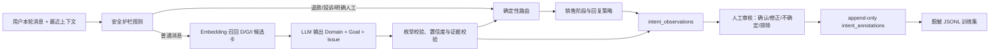

# 销售意图识别 V1：生产架构与数据闭环

> 历史状态：该意图分类、阶段和确定性路由已退出生产主链，本文件仅供历史追溯，不是现役架构说明。当前生产入口见 [Sales Agent Harness V2](agent-harness-v2/README.md)。

## 1. 当前目标

V1 不训练专用模型，先用“高精度规则 + 语义候选召回 + 大模型结构化分类 + 确定性策略”正式承接线上流量，并把每个真实分类输入沉淀成可审核数据。

这里的“一条”是一次意图识别器实际接收的用户回合，而不是按逗号、句号机械拆句。微信连续短消息如果在进入模型前被合并，日志也保存合并后的输入；这样训练数据和线上推理输入保持一致。

## 2. 在线识别架构



### 2.1 识别职责

- Domain：客户在谈哪类业务对象。
- Goal：客户这一轮想完成什么动作。
- Issue：消息涉及哪些具体议题，可以多选，也可以为空。
- scope：业务范围内、信息不明确或业务范围外。
- route：不交给模型自由生成，由校验后的 D/G/I 确定性计算。
- sales stage：不等于意图，由跨轮状态机结合意图、槽位和可信交易事实更新。

### 2.2 固定动作

“要资料”属于 `Goal=request_material`。命中陪伴养兰固定资料时直接执行资源发送，同时写入意图观测；退款、投诉和明确人工请求的安全优先级高于资料发送。

未进入分类器的固定欢迎语、图片失败、人工锁定等旁路消息也会产生观测记录，并标记为 `classifier_source=bypass_route`。销售工作台、微信客户端等人工发送消息，以及后台页面标题等内部噪声不会进入意图观测。

## 3. 日志模型

### 3.1 intent_observations

每个 `trace_id` 一条，记录模型做判断时的完整快照：

- 用户消息、最近六轮上下文；
- taxonomy 版本；
- 分类来源、模型 Provider 和模型名；
- 语义召回候选及分数；
- 模型原始 JSON；
- 最终 Domain、Goal、Issue、scope、证据与置信度；
- 分类器建议路由、策略最终路由、旧意图和销售阶段。
- 对应销售工作台会话 ID 和原始客户消息主键，可从日志直接定位到会话位置。

该表是事实快照。重新审核不会修改当时的模型预测。

### 3.2 intent_annotations

人工审核采用只追加、不覆盖的审计模型。一条观测可以有多次审核，以最新一条作为当前结论，同时保留全部历史。

| 状态 | 含义 | 是否进入训练集 |
| --- | --- | --- |
| `confirmed` | 模型预测正确；置信度不低于 0.75 时系统默认该状态，人工仍可修改 | 是，使用模型预测标签并区分自动/人工来源 |
| `corrected` | 人工填写了正确 D/G/I | 是，使用人工修正标签 |
| `uncertain` | 当前信息仍无法可靠判断 | 否 |
| `excluded` | 噪声、隐私风险或不适合训练 | 否 |
| `pending` | 低于 0.75 且尚未处理 | 否 |

默认审核策略是“高置信度预测正确，低置信度进入待修正”。任何人工结论都优先于系统默认状态；人工标记为 `uncertain` 或 `excluded` 后，即使原置信度较高也不会进入训练集。

## 4. 后台操作

管理后台的“意图标注日志”支持：

- 按审核状态、Domain、Goal、识别来源、置信度和关键词筛选；
- 查看当前消息、分类时上下文、候选标签、证据和模型原始输出；
- 一键定位到销售工作台中的对应客户消息并高亮；
- 快速确认预测，或修正主/次 Domain、主/次 Goal、Issue 与 scope；
- 查看完整审核历史；
- 一键导出已审核 JSONL。

主要接口：

- `GET /api/v1/admin/intent-observations`
- `GET /api/v1/admin/intent-observations/{trace_id}`
- `POST /api/v1/admin/intent-observations/{trace_id}/annotations`
- `GET /api/v1/admin/intent-taxonomy`
- `GET /api/v1/admin/intent-training-data/export`

训练集导出默认对手机号、身份证号和邮箱做占位符脱敏。原始生产日志仅允许后台授权人员访问。

## 5. 什么时候开始训练

不要因为积累了几十或几百条数据就立即训练。建议同时满足以下条件：

1. 至少有 3,000～5,000 条完成审核的真实用户回合；
2. 高频 Goal 和 Issue 各自至少有约 100 条有效样本，关键少数类需主动补样；
3. 抽取至少 10% 的样本做双人复标，一致率稳定；
4. 固定一份不再参与训练的黄金测试集；
5. 数据集按客户或会话切分，不能把同一会话拆到训练集和测试集两边；
6. 时间上保留最新一段数据做额外测试，以验证线上分布变化。

第一版专用模型建议采用共享中文文本编码器加多个分类头：Domain 单/多标签头、Goal 单/多标签头、Issue 多标签头、scope 分类头。上下文和当前消息共同编码，规则只保留为安全护栏。模型上线前必须完成置信度校准，并继续保留低置信度回退到大模型或澄清的路径。

## 6. 需要持续关注的指标

- Domain、Goal、Issue 分维度准确率和 macro-F1；
- 各标签混淆矩阵，尤其是 `ask_information/request_material/request_service`；
- 低置信度率、人工修正率和排除率；
- 安全类 Goal 的漏判率；
- 新增样本量、已审核覆盖率和各标签数据分布；
- 线上模型版本、taxonomy 版本与数据漂移。

## 7. 生产配置

生产环境必须启用：

```dotenv
INTENT_LLM_ENABLED=true
INTENT_OBSERVATION_ENABLED=true
INTENT_AUTO_CONFIRM_THRESHOLD=0.75
CHAT_LOG_ENABLED=true
```

Embedding 应使用真实的 BGE 或兼容服务，不能使用 `mock`。意图模型、Embedding 模型和 taxonomy 版本都会随观测一起记录，方便以后按版本评估和回滚。
