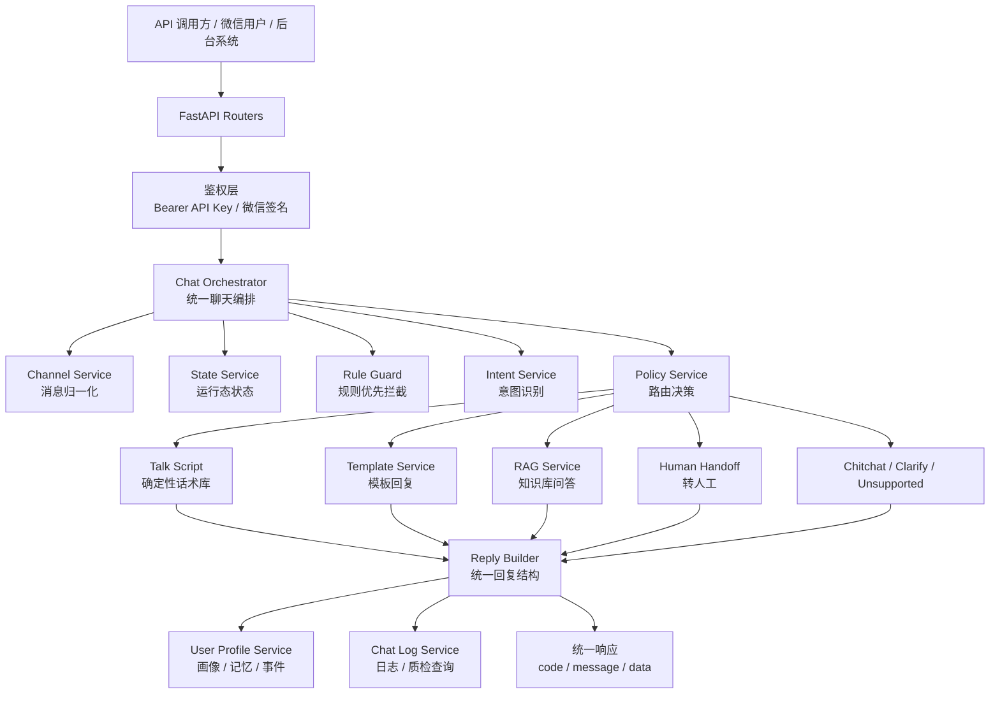
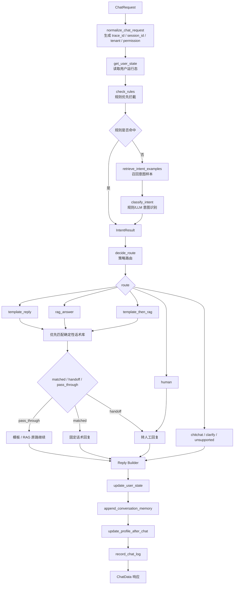
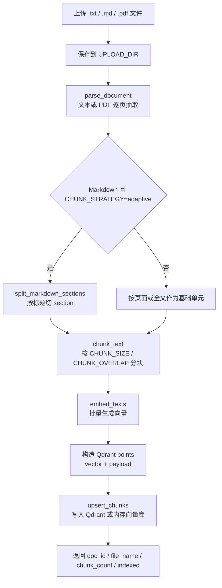
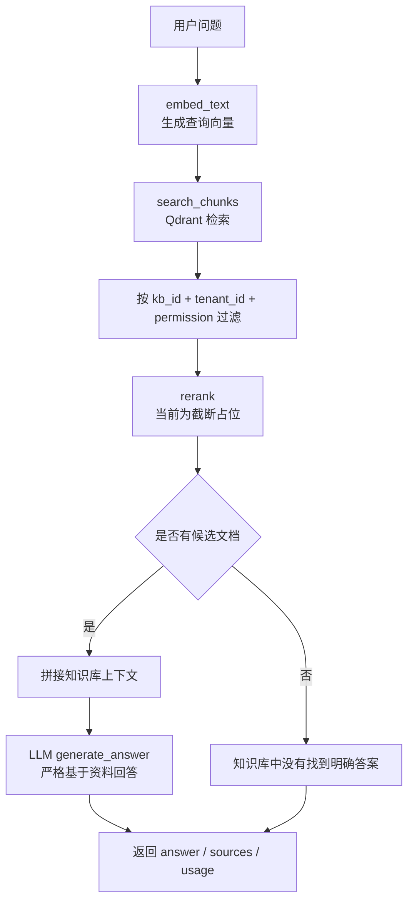
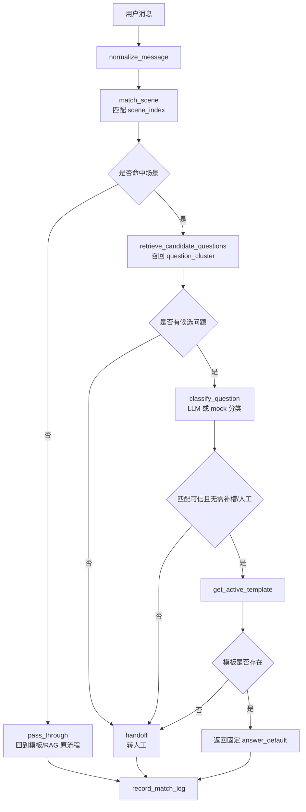
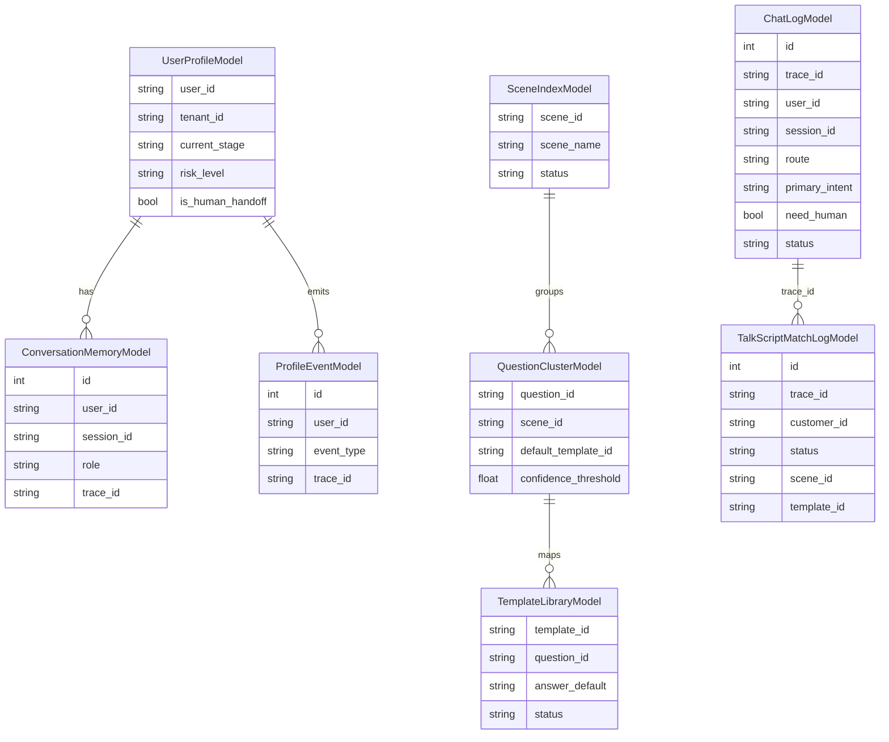

# 智能客服后端项目框架文档

本文档用于说明 `wechat_rag_bot` 后端项目的整体架构、核心流程、模块职责和数据流向。接口字段细节以 `docs/backend_core_framework.md` 为准，本文更偏项目框架总览。

## 1. 项目定位

`wechat_rag_bot` 是一个以统一聊天入口为核心的智能客服后端。系统把 API、微信等渠道消息归一化后，统一进入聊天编排器，再按规则、意图、策略决定走确定性话术、模板回复、知识库 RAG、闲聊或转人工。

当前技术栈：

- Web 框架：FastAPI
- 配置：Pydantic Settings + `.env`
- 数据库：SQLAlchemy + SQLite
- 向量检索：Qdrant，未配置真实地址时使用进程内存模式
- 模型能力：Embedding Provider + LLM Provider，默认支持 mock 离线模式
- 微信接入：微信签名校验、XML 解析、XML 回复、进程内消息去重

## 2. 总体架构图



## 3. 目录结构与分层

```text
wechat_rag_bot/
  app/
    main.py                # FastAPI 应用入口、路由注册、统一异常处理、健康检查
    config.py              # 环境变量配置
    routers/               # HTTP/API/微信入口层
    services/              # 业务服务层
    talk_script/           # 确定性话术库领域模块
    schemas/               # 请求、响应、内部数据结构
    db/                    # SQLAlchemy Base 与数据库模型
    utils/                 # 鉴权、日志、ID、时间等工具
    scripts/               # 离线导入脚本
  docs/
    backend_core_framework.md
    project_framework.md
  tests/                   # 接口、服务、编排、RAG、微信等测试
```

分层说明：

| 层级 | 作用 | 典型文件 |
| --- | --- | --- |
| 应用入口层 | 创建 FastAPI 应用、注册路由、处理统一异常 | `app/main.py` |
| Router 层 | 接收 HTTP 请求、做鉴权依赖、调用服务层、包装统一响应 | `app/routers/*.py` |
| 编排层 | 串联聊天主流程，决定各业务模块调用顺序 | `app/services/chat_orchestrator.py` |
| 服务层 | 实现意图、策略、模板、RAG、日志、画像等业务能力 | `app/services/*.py` |
| 话术领域层 | Excel 话术库导入、场景匹配、问题分类、固定话术输出 | `app/talk_script/*.py` |
| Schema 层 | 定义 API 契约和内部结构化对象 | `app/schemas/*.py` |
| 数据层 | 定义聊天日志、用户画像、话术库等关系表 | `app/db/models.py` |
| 工具层 | API Key 鉴权、业务 ID、日志、时间工具 | `app/utils/*.py` |

## 4. 对外入口

### 4.1 业务 API

业务 API 默认使用 Bearer API Key 鉴权，统一返回：

```json
{
  "code": 0,
  "message": "success",
  "data": {}
}
```

主要入口：

| 接口 | 作用 | 主处理模块 |
| --- | --- | --- |
| `GET /health` | 健康检查 | `app/main.py` |
| `POST /api/v1/chat` | 统一聊天入口 | `chat_orchestrator.handle_chat` |
| `POST /api/v1/knowledge/upload` | 知识库文件上传与入库 | `knowledge_service.index_document` |
| `POST /api/v1/templates` | 创建或更新模板 | `template_service.create_template` |
| `POST /api/v1/templates/search` | 搜索候选模板 | `template_service.search_templates` |
| `POST /api/v1/intent-examples` | 写入意图样本 | `intent_example_service.add_intent_example` |
| `GET/PATCH /api/v1/users/{user_id}/state` | 查询、更新用户运行态 | `state_service` |
| `GET/PATCH /api/v1/users/{user_id}/profile` | 查询、维护用户画像 | `user_profile_service` |
| `GET /api/v1/users/{user_id}/memories` | 查询聊天记忆 | `user_profile_service` |
| `GET /api/v1/users/{user_id}/profile/events` | 查询画像事件 | `user_profile_service` |
| `POST /api/v1/debug/intent` | 调试意图、策略和样本召回 | `debug.py` |
| `GET /api/v1/admin/chat-logs` | 分页查询聊天日志 | `chat_log_service` |
| `GET /api/v1/admin/chat-logs/{trace_id}` | 查询单条日志详情 | `chat_log_service` |
| `GET /api/v1/admin/chat-log-stats` | 查询日志统计 | `chat_log_service` |

### 4.2 微信入口

微信入口不使用 Bearer API Key，而是走微信签名校验。

| 接口 | 作用 |
| --- | --- |
| `GET /wechat/callback` | 微信服务器 URL 验证 |
| `POST /wechat/callback` | 微信消息回调 |

微信文本消息会被包装成 `ChatRequest`，然后同样进入 `handle_chat`，因此微信不会绕过统一聊天主流程。

## 5. 统一聊天主流程

核心入口：`app/services/chat_orchestrator.py::handle_chat`



主流程特点：

- `session_id` 为空时自动生成，用于一轮或一段会话标识。
- `trace_id` 用于单次请求排查、日志查询和话术匹配日志关联。
- 规则拦截优先于普通意图识别。
- 策略层输出 `route`，回复层按 route 决定走模板、RAG、转人工等。
- `template_reply`、`rag_answer`、`template_then_rag` 在进入原流程前会先尝试确定性话术库。
- 明确人工、退款、投诉等高风险场景会转人工；低风险信息不足或低置信知识类问题优先进入 LLM/RAG 兜底。
- 聊天成功或失败都会尽量写入聊天日志；日志写入失败不应影响主流程。

## 6. 路由与回复策略

| route | 语义 | 后续动作 |
| --- | --- | --- |
| `template_reply` | 价格、售后、物流、下单、优惠等适合模板回答的问题 | 先查确定性话术库，再查模板；模板缺失则转人工 |
| `rag_answer` | 知识、资料、方法、说明类问题 | 先查确定性话术库，再走知识库 RAG；无答案则转人工 |
| `template_then_rag` | 需要销售话术加知识解释的混合问题 | 模板和 RAG 都可用时组合回复，否则转人工 |
| `human` | 投诉、退款、强烈不满、明确需要人工等 | 创建转人工回复 |
| `chitchat` | 简单寒暄 | 直接构造轻量回复 |
| `clarify` | 表达不清或低置信度 | 转入 RAG/LLM 兜底追问或给原则性建议 |
| `unsupported` | 明显业务外或不支持问题 | 返回不支持回复，不默认转人工 |

最终响应由 `FinalReply` 转成 `ChatData`，包含：

- `answer`：给用户的答案，转人工时为空字符串
- `sources`：RAG 来源
- `usage`：模型 token 使用量
- `reply_type`：`template`、`rag`、`human` 等
- `route`：最终路由
- `intent`：结构化意图结果
- `template`：模板信息
- `need_human`、`next_action`：转人工标记
- `trace_id`：请求追踪 ID
- `metadata`、`handoff`：扩展观察信息

## 7. 知识库入库流程

入口：`POST /api/v1/knowledge/upload`

核心服务：`app/services/knowledge_service.py::index_document`



每个知识块 payload 固定包含：

- `text`
- `kb_id`
- `doc_id`
- `chunk_id`
- `file_name`
- `file_type`
- `page`
- `section`
- `tenant_id`
- `permission`
- `created_at`

## 8. RAG 问答流程

核心服务：`app/services/rag_service.py`



关键边界：

- 默认只根据知识库资料回答，不允许编造。
- 检索固定受 `kb_id + tenant_id + permission` 三个字段约束。
- `QDRANT_URL` 为空或占位时使用进程内 `_memory_points`，重启后数据丢失。
- 当前 `rerank_service` 是占位实现，只返回前 `top_n` 条。

## 9. 确定性话术库流程

领域模块：`app/talk_script/`

用途：对兰花私域等高确定性客服话术做结构化管理。Excel 导入 SQLite 后，运行时先匹配场景和问题，命中后直接返回 `template_library.answer_default`，不走 RAG，也不让 LLM 生成最终客服话术。



主要表：

- `scene_index`：场景索引
- `question_cluster`：问题簇与候选问题
- `template_library`：固定回答模板
- `talk_script_match_logs`：话术匹配日志

## 10. 用户状态、画像与记忆

系统中有两类用户相关数据：

| 类型 | 作用 | 存储 |
| --- | --- | --- |
| 用户运行态 `state` | 当前阶段、标签、最近意图等轻量状态 | 当前主要为内存实现 |
| 用户画像 `profile` | 长期画像、偏好、痛点、人工状态、最近活跃信息 | SQLite，`user_profiles` |

聊天成功后会自动写入：

```text
append_conversation_memory(role="user")
append_conversation_memory(role="assistant")  # answer 非空时
update_profile_after_chat(...)
```

当回复需要转人工时，会更新画像中的人工字段，并写入画像事件：

- `is_human_handoff = true`
- `human_handoff_status = pending`
- `human_handoff_reason = ...`
- `profile_events.event_type = handoff_created`

用户身份主键当前为 `user_id`。真实渠道联调时，同一真实客户必须稳定映射到同一个 `user_id`，否则画像和记忆会被拆散。

## 11. 日志与质检

核心服务：`app/services/chat_log_service.py`

聊天编排器在 `finally` 中调用 `record_chat_log`，因此成功和失败路径都会尽量落日志。日志字段覆盖：

- 请求追踪：`trace_id`、`request_id`、`message_id`
- 用户与会话：`channel`、`user_id`、`session_id`
- 知识库隔离：`kb_id`、`tenant_id`、`permission`
- 输入输出：`user_message`、`answer`、`sources`、`usage`
- 业务决策：`route`、`reply_type`、`primary_intent`、`confidence`、`template_id`
- 人工标记：`need_human`、`next_action`
- 性能：`latency_ms`、`stage_latencies`
- 状态：`status`、`error_code`、`error_message`

后台日志接口支持分页查询、详情查询和统计查询，可用于调试、质检和后续运营分析。

## 12. 数据模型总览



## 13. 配置与外部依赖

核心配置集中在 `app/config.py`，常用项如下：

| 配置 | 作用 |
| --- | --- |
| `API_AUTH_ENABLED`、`API_KEY` | 业务 API 鉴权 |
| `WECHAT_TOKEN`、`WECHAT_DEFAULT_KB_ID` | 微信签名和默认知识库 |
| `QDRANT_URL`、`QDRANT_API_KEY`、`QDRANT_COLLECTION` | 向量库连接 |
| `QDRANT_VECTOR_SIZE`、`QDRANT_DISTANCE` | 向量维度和距离算法 |
| `EMBEDDING_PROVIDER`、`EMBEDDING_MODEL` | Embedding 模型 |
| `LLM_PROVIDER`、`LLM_MODEL` | 默认 LLM |
| `RAG_LLM_PROVIDER`、`INTENT_LLM_PROVIDER`、`TALK_SCRIPT_LLM_PROVIDER` | 不同用途专用模型 |
| `RAG_TOP_K`、`RAG_TOP_N` | RAG 检索和重排数量 |
| `RAG_KNOWLEDGE_ENABLED` | 是否启用本地/向量知识库检索；默认关闭，RAG 走无来源 LLM 客服兜底 |
| `CHUNK_SIZE`、`CHUNK_OVERLAP`、`CHUNK_STRATEGY` | 文档分块策略 |
| `DATABASE_URL` | 用户画像、记忆、话术库等关系数据 |
| `CHAT_LOG_ENABLED`、`CHAT_LOG_DB_URL` | 聊天日志存储 |
| `UPLOAD_DIR` | 上传文件保存目录 |

默认 mock 模式适合本地离线验证：

```dotenv
API_AUTH_ENABLED=false
QDRANT_URL=
EMBEDDING_PROVIDER=mock
LLM_PROVIDER=mock
INTENT_LLM_PROVIDER=mock
```

## 14. 当前实现边界

- 业务 API 固定使用 `code/message/data` 统一响应 envelope。
- 微信入口只做渠道适配，仍然进入统一聊天主流程。
- 确定性话术库优先于模板和 RAG，命中后直接返回固定话术。
- RAG 检索固定按 `kb_id + tenant_id + permission` 隔离。
- Qdrant 未配置真实地址时使用进程内存，服务重启后知识向量丢失。
- 微信消息去重也是进程内存，多实例部署时需要替换为 Redis 等共享存储。
- `rerank_service` 当前是占位截断，不是真实重排模型。
- `state_service` 当前偏轻量内存状态，长期画像走 SQLite。
- 转人工当前生成工单 ID 和结构化 metadata，但真实人工系统推送仍是预留接口。
- 源码中部分中文提示存在编码异常，建议后续单独统一修复文案编码。

## 15. 后续开发入口建议

| 修改目标 | 优先关注文件 |
| --- | --- |
| 改聊天接口字段 | `app/schemas/chat.py`、`app/routers/chat.py`、`app/services/chat_orchestrator.py` |
| 改聊天主链路 | `app/services/chat_orchestrator.py` |
| 改意图识别 | `app/services/intent_service.py`、`app/services/intent_example_service.py` |
| 改策略路由 | `app/services/policy_service.py` |
| 改模板回复 | `app/services/template_service.py`、`app/services/reply_builder.py` |
| 改 RAG 回答 | `app/services/rag_service.py`、`app/services/qdrant_service.py`、`app/services/rerank_service.py` |
| 改知识库入库 | `app/routers/knowledge.py`、`app/services/knowledge_service.py` |
| 改确定性话术库 | `app/talk_script/service.py`、`app/talk_script/matcher.py`、`app/talk_script/repository.py` |
| 改微信接入 | `app/routers/wechat.py`、`app/services/wechat_service.py` |
| 改用户画像 | `app/services/user_profile_service.py`、`app/db/models.py` |
| 改日志和质检 | `app/services/chat_log_service.py`、`app/routers/admin_logs.py` |
