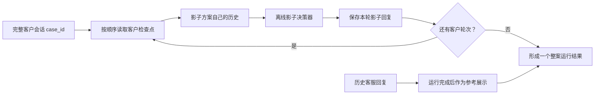

# 整案案例库与影子回放

> 历史状态：影子回放已退出生产运行，本文件记录旧离线评测设计；其中运行入口和硬约束不得作为当前 Sales Agent 行为依据。现役评测原则见 [`agent-harness-v2/10-evaluation-and-acceptance.md`](../agent-harness-v2/10-evaluation-and-acceptance.md)。

## 目标

整案案例库以“一位客户的一整段聊天”为最小存储、运行和审核单位。对话内部保留原始顺序，并生成顺序检查点，但不会把检查点拆成独立案例。

当前 77 个客户会话统一编号为 `case001`～`case077`，编号不再体现导入批次。后续导入会读取当前最大编号并顺延，不重新分批编号。

每个编号对应两个物理隔离的版本：

- `data/conversation_cases/complete/`：完整案例库，用于归档与人工核对；
- `data/conversation_cases/cleaned/`：清洗后案例库，用于意图标注与影子回放。

两个版本不可互相替代或合并；运行时通过 `library_type=complete|cleaned` 明确选择。

## 数据原则

1. 每个编号在两个库中各有一个文件，并共享稳定 `case_id`。
2. `turns` 保留客户与历史客服的完整轮次；每条轮次都有稳定 `turn_id`。
3. 客户轮次会生成 `checkpoint_id`，仅用于顺序执行和定位结果。
4. 历史客服回复是 `reference_only`，只用于人工对照，不是标准答案。
5. 摘要重建、聊天导出、逐字清洗等质量差异由 `content_quality` 明确标记；系统不会补造缺失对话。

## 影子回放

从管理端“清洗后案例库”启动一个案例后，系统按客户轮次顺序生成影子回复；完整案例库不会进入模型回放：

影子提示词不包含当轮历史客服回复，防止候选方案照抄参考答案。影子回复只写入评测运行表，不会发送给客户，不写客户状态，不调用订单、物流、人工接管或其他外部动作。

`case_shadow_v2_2` 还会在每轮输出后执行硬约束检查：

- 没有检索证据时不得选择 `rag_answer`；
- `facts_used` 只能引用输入中的已验证事实；
- 回复不超过 220 个字符；
- 每轮最多追问一个问题。

候选违反上述约束时，Harness 会带着具体违规项最多自动修正两次。修正后仍存在的问题会保留在 `auto_issues` 中，并汇总到整案运行结果，不能以“生成成功”代替“质量通过”。

当 `follow_up.needed=false` 时，Harness 会把无意义的空动作、`due_in_hours=0` 和取消条件确定性归一化为空值；这类格式差异不再浪费一次模型修正，也不会被误判为整个检查点失败。

当前模式是确定性的历史回放：后续客户消息仍来自原聊天，因此候选方案与原客服回复明显分叉时，后续消息可能出现反事实不一致。这类情况应在人工审核中标记；后续可在稳定回归集之外增加客户模拟器，但不能替代固定历史回放。

## 管理入口

- 页面：`/operations/conversation-cases`
- 列表接口：`GET /api/v1/admin/conversation-cases?library_type=complete|cleaned`
- 案例详情：`GET /api/v1/admin/conversation-cases/{case_id}?library_type=complete|cleaned`
- 启动回放：`POST /api/v1/admin/conversation-cases/{case_id}/runs`
- 运行详情：`GET /api/v1/admin/conversation-cases/runs/{run_id}`
- 导出案例库：`GET /api/v1/admin/conversation-cases/export?library_type=complete|cleaned`

同一案例已有 `pending` 或 `running` 任务时，重复启动会返回现有任务，避免重复模型调用。
