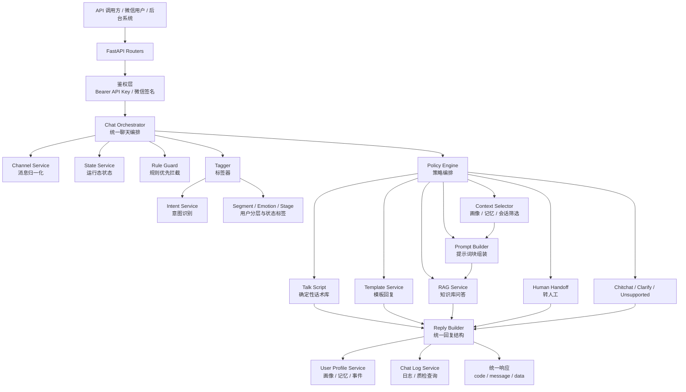
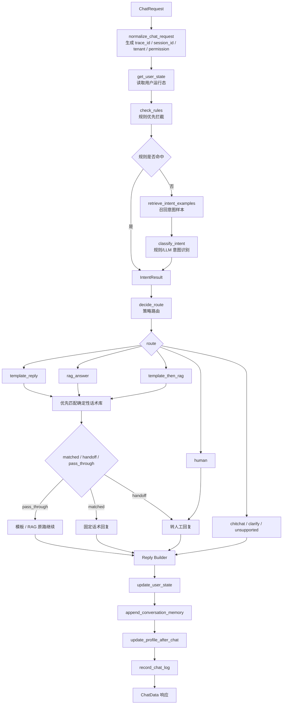
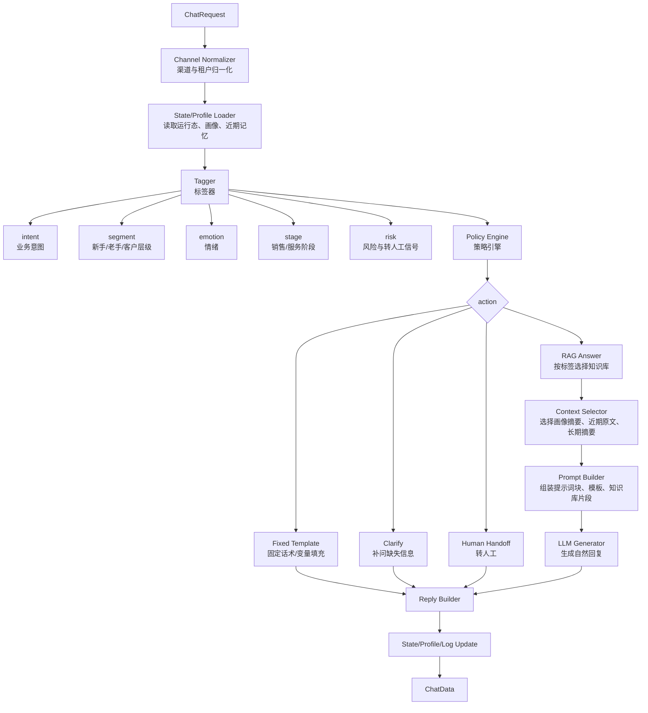
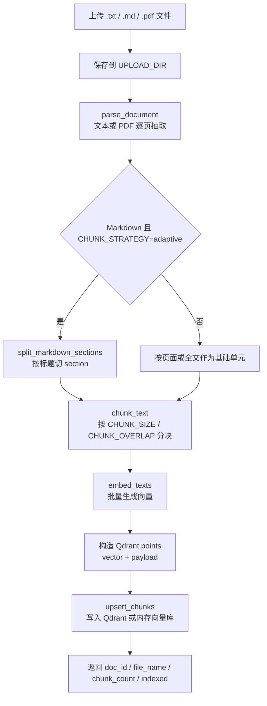
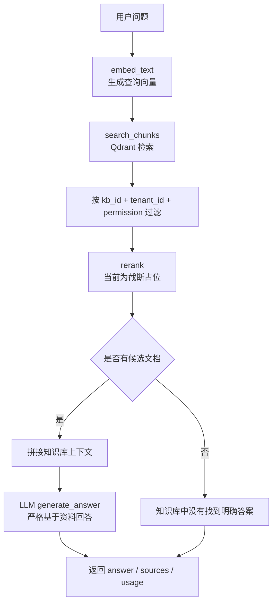
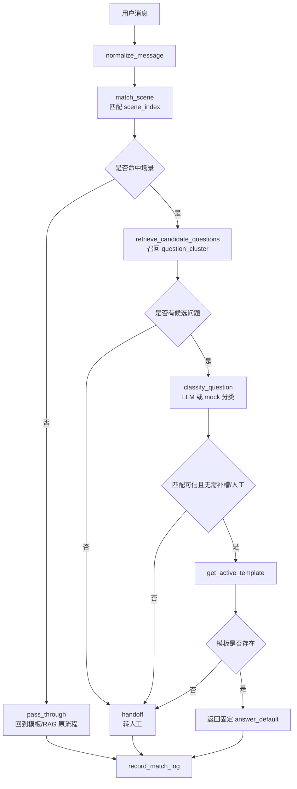
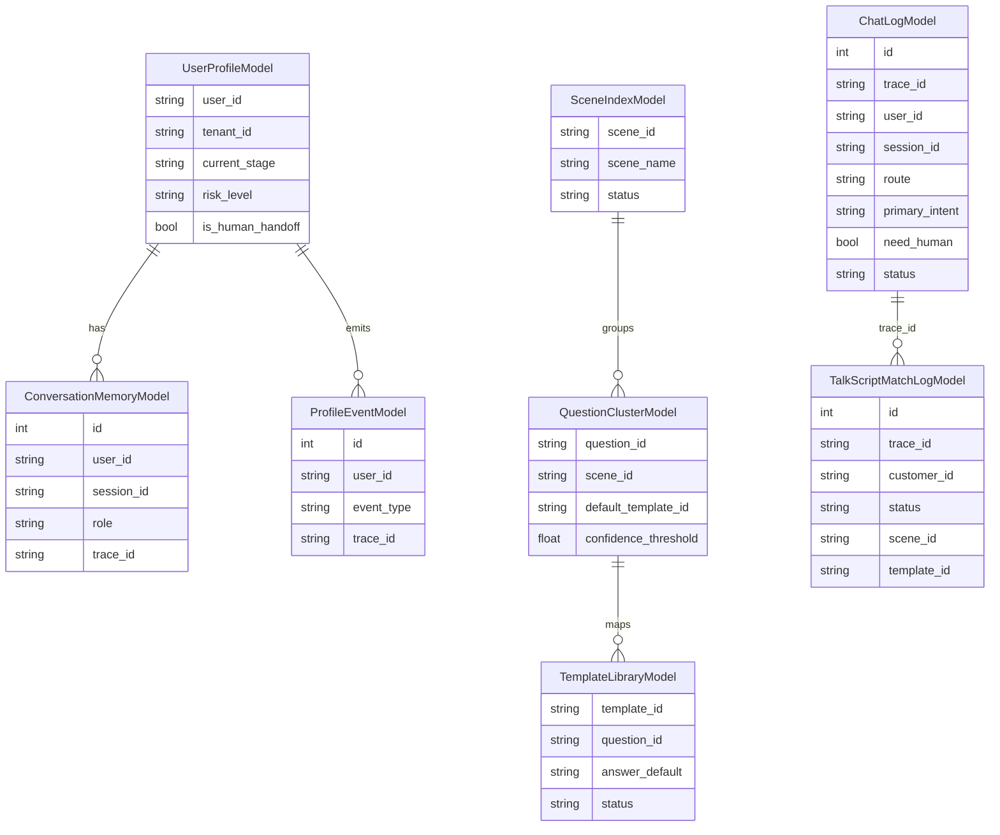
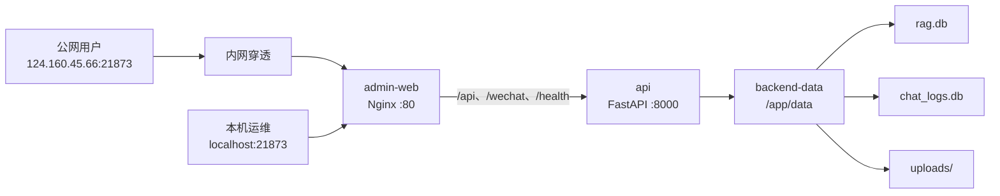

# 智能客服后端项目框架文档

本文档用于说明 `wechat_rag_bot` 后端项目的整体架构、核心流程、模块职责和数据流向。接口字段细节以 `docs/backend_core_framework.md` 为准，本文更偏项目框架总览。

## 1. 项目定位

`wechat_rag_bot` 是一个以统一聊天入口为核心的智能客服后端。系统把 API、微信等渠道消息归一化后，统一进入聊天编排器，再按规则、标签、意图、策略决定走确定性话术、模板回复、知识库 RAG、闲聊或转人工。

后续主链路建议升级为“标签驱动的策略编排系统”，而不是一开始全面多 Agent 化。标签器负责识别用户分层、业务意图、情绪、阶段和风险；策略引擎根据标签选择下一步动作，例如命中固定话术、选择知识库、选择提示词块、选择语气、补问信息或转人工；Prompt Builder 再把策略结果、上下文、模板和知识库片段组装成稳定的模型输入。

当前技术栈：

- Web 框架：FastAPI
- 配置：Pydantic Settings + `.env`
- 数据库：SQLAlchemy + SQLite
- 向量检索：Qdrant，未配置真实地址时使用进程内存模式
- 模型能力：Embedding Provider + LLM Provider，默认支持 mock 离线模式
- 微信接入：微信签名校验、XML 解析、XML 回复、进程内消息去重

## 2. 总体架构图



## 3. 目录结构与分层

```text
wechat_rag_bot/
  app/
    main.py                # FastAPI 应用入口、路由注册、统一异常处理、健康检查
    config.py              # 环境变量配置
    routers/               # HTTP/API/微信入口层
    services/              # 业务服务层
    talk_script/           # 确定性话术库领域模块
    schemas/               # 请求、响应、内部数据结构
    db/                    # SQLAlchemy Base 与数据库模型
    utils/                 # 鉴权、日志、ID、时间等工具
    scripts/               # 离线导入脚本
  docs/
    backend_core_framework.md
    project_framework.md
  tests/                   # 接口、服务、编排、RAG、微信等测试
```

分层说明：

| 层级 | 作用 | 典型文件 |
| --- | --- | --- |
| 应用入口层 | 创建 FastAPI 应用、注册路由、处理统一异常 | `app/main.py` |
| Router 层 | 接收 HTTP 请求、做鉴权依赖、调用服务层、包装统一响应 | `app/routers/*.py` |
| 编排层 | 串联聊天主流程，决定各业务模块调用顺序 | `app/services/chat_orchestrator.py` |
| 服务层 | 实现标签、意图、策略、模板、RAG、提示词构建、日志、画像等业务能力 | `app/services/*.py` |
| 话术领域层 | Excel 话术库导入、场景匹配、问题分类、固定话术输出 | `app/talk_script/*.py` |
| Schema 层 | 定义 API 契约和内部结构化对象 | `app/schemas/*.py` |
| 数据层 | 定义聊天日志、用户画像、话术库等关系表 | `app/db/models.py` |
| 工具层 | API Key 鉴权、业务 ID、日志、时间工具 | `app/utils/*.py` |

## 4. 对外入口

### 4.1 业务 API

业务 API 默认使用 Bearer API Key 鉴权，统一返回：

```json
{
  "code": 0,
  "message": "success",
  "data": {}
}
```

主要入口：

| 接口 | 作用 | 主处理模块 |
| --- | --- | --- |
| `GET /health` | 健康检查 | `app/main.py` |
| `POST /api/v1/chat` | 统一聊天入口 | `chat_orchestrator.handle_chat` |
| `POST /api/v1/knowledge/upload` | 知识库文件上传与入库 | `knowledge_service.index_document` |
| `POST /api/v1/templates` | 创建或更新模板 | `template_service.create_template` |
| `POST /api/v1/templates/search` | 搜索候选模板 | `template_service.search_templates` |
| `POST /api/v1/intent-examples` | 写入意图样本 | `intent_example_service.add_intent_example` |
| `GET/PATCH /api/v1/users/{user_id}/state` | 查询、更新用户运行态 | `state_service` |
| `GET/PATCH /api/v1/users/{user_id}/profile` | 查询、维护用户画像 | `user_profile_service` |
| `GET /api/v1/users/{user_id}/memories` | 查询聊天记忆 | `user_profile_service` |
| `GET /api/v1/users/{user_id}/profile/events` | 查询画像事件 | `user_profile_service` |
| `POST /api/v1/debug/intent` | 调试意图、策略和样本召回 | `debug.py` |
| `GET /api/v1/admin/chat-logs` | 分页查询聊天日志 | `chat_log_service` |
| `GET /api/v1/admin/chat-logs/{trace_id}` | 查询单条日志详情 | `chat_log_service` |
| `GET /api/v1/admin/chat-log-stats` | 查询日志统计 | `chat_log_service` |

### 4.2 微信入口

微信入口不使用 Bearer API Key，而是走微信签名校验。

| 接口 | 作用 |
| --- | --- |
| `GET /wechat/callback` | 微信服务器 URL 验证 |
| `POST /wechat/callback` | 微信消息回调 |

微信文本消息会被包装成 `ChatRequest`，然后同样进入 `handle_chat`，因此微信不会绕过统一聊天主流程。

## 5. 统一聊天主流程

核心入口：`app/services/chat_orchestrator.py::handle_chat`



主流程特点：

- `session_id` 为空时自动生成，用于一轮或一段会话标识。
- `trace_id` 用于单次请求排查、日志查询和话术匹配日志关联。
- 规则拦截优先于普通意图识别。
- 策略层输出 `route`，回复层按 route 决定走模板、RAG、转人工等。
- `template_reply`、`rag_answer`、`template_then_rag` 在进入原流程前会先尝试确定性话术库。
- 明确人工、退款、投诉等高风险场景会转人工；低风险信息不足或低置信知识类问题优先进入 LLM/RAG 兜底。
- 聊天成功或失败都会尽量写入聊天日志；日志写入失败不应影响主流程。

### 5.1 标签驱动的策略编排目标链路

目标链路用于实现“打不同标签后改变下一步动作”：同一条用户消息先被识别成结构化标签，再由策略引擎选择固定模板、知识库范围、提示词块、语气、上下文和输出方式。这个设计优先使用可配置规则和模板，不要求先训练模型，也不要求把每个处理节点都升级成 Agent。



推荐的模块职责：

| 模块 | 输入 | 输出 | 说明 |
| --- | --- | --- | --- |
| `Tagger` | 当前消息、近期对话、用户画像摘要 | `TagResult` | 只负责打标签，不直接生成最终回复 |
| `Policy Engine` | `TagResult`、租户、渠道、运行态 | `PolicyDecision` | 决定下一步动作、知识库、模板、提示词块、语气和是否转人工 |
| `Template Library` | `template_ids`、变量 | 固定话术或变量填充话术 | 用于开场白、特定问题固定回答、合规话术、转人工话术 |
| `Context Selector` | 画像、记忆、历史对话、当前策略 | 本轮上下文包 | 近期对话保留原文，长期历史用摘要，画像用结构化摘要 |
| `Knowledge Router` | `knowledge_base_ids`、检索关注点 | RAG 检索参数 | 根据标签选择不同知识库和检索重点 |
| `Prompt Builder` | 策略、提示词块、模板、上下文、知识片段、当前问题 | LLM messages/prompt | 负责组装模型输入，不承担业务决策 |
| `Reply Builder` | 固定模板结果或 LLM 结果 | `ChatData` | 统一响应结构、来源、转人工、metadata |

核心数据结构建议：

```json
{
  "tag_result": {
    "intent": "orchid_care",
    "segment": "beginner",
    "emotion": "anxious",
    "stage": "first_order_nurture",
    "risk_level": "low",
    "entities": {
      "problem": "烂根",
      "plant_type": "兰花"
    },
    "confidence": 0.88
  }
}
```

```json
{
  "policy_decision": {
    "action": "rag_answer",
    "knowledge_base_ids": ["kb_orchid_basic", "kb_after_sales_faq"],
    "template_ids": ["opening_beginner_care"],
    "prompt_block_ids": [
      "base.customer_service",
      "scenario.orchid_care",
      "intent.orchid_problem",
      "segment.beginner",
      "emotion.anxious",
      "tone.patient_step_by_step",
      "output.customer_reply"
    ],
    "context_policy": {
      "recent_turns": 6,
      "include_profile_summary": true,
      "include_long_memory_summary": true
    },
    "retrieval_policy": {
      "focus": ["基础原因", "处理步骤", "常见错误", "售后服务"],
      "exclude": ["高级繁殖", "复杂药剂配比"]
    },
    "fallback": "human"
  }
}
```

标签到策略的配置示例：

```json
{
  "rules": [
    {
      "when": {
        "intent": "orchid_care",
        "segment": "beginner"
      },
      "then": {
        "action": "rag_answer",
        "knowledge_base_ids": ["kb_orchid_basic", "kb_care_faq"],
        "template_ids": ["opening_beginner_care"],
        "prompt_block_ids": ["segment.beginner", "tone.patient_step_by_step"],
        "retrieval_focus": ["是什么", "为什么", "第一步怎么做", "常见错误"]
      }
    },
    {
      "when": {
        "intent": "orchid_care",
        "segment": "advanced"
      },
      "then": {
        "action": "rag_answer",
        "knowledge_base_ids": ["kb_orchid_advanced", "kb_best_practices"],
        "template_ids": ["opening_advanced_care"],
        "prompt_block_ids": ["segment.advanced", "tone.concise_professional"],
        "retrieval_focus": ["限制条件", "进阶处理", "关键参数", "最佳实践"]
      }
    },
    {
      "when": {
        "risk_level": "high"
      },
      "then": {
        "action": "human",
        "template_ids": ["handoff_risk_high"]
      }
    }
  ]
}
```

Prompt Builder 的组装顺序建议固定为：

```text
base system prompt
-> safety/compliance prompt block
-> scenario prompt block
-> intent prompt block
-> segment prompt block
-> emotion/tone prompt block
-> output format prompt block
-> selected template content
-> user profile summary
-> session state
-> recent conversation raw turns
-> long memory summary
-> retrieved knowledge snippets
-> current user message
```
当前已落地的标签策略模块：

| 标签大类 | 数据库/服务 | 当前策略 | 回复影响 |
| --- | --- | --- | --- |
| 客户等级 `L1-L6` | `customer_level_profiles`、`customer_level_rules`、`customer_level_prompt_bindings`、`customer_level_service.py` | `L1-L3` 完整进入 AI 策略；`L4-L6` 只识别并默认转人工 | `L1` 偏新手信任和低风险推荐；`L2` 偏基础纠错和区域养护；`L3` 偏经验型沟通、苗源、环境、病虫害和经典品种；`L4-L6` 不自动回复 |
| 养兰数量 | `tag_prompt_bindings`、`business_tag_prompt_service.py` | 按 `1-30盆`、`30-100盆`、`100盆以上` 分成小/中/大规模侧重点 | 小规模强调信心、基础养护、低风险选择；中规模强调养护流程和品类扩展；大规模强调批量管理、预防、效率 |
| 所在省份 | `tag_prompt_bindings`、`business_tag_prompt_service.py` | 将省份映射到华东、北方、华南、西南、西北等推荐倾向 | 华东偏经典国兰和稳定老品种；北方偏耐冷耐干、春化和易养；华南偏耐热、通风、防病，建兰/墨兰更适合作示例；西南/西北按湿度、海拔、干燥和室内管理调整 |
| 用户喜欢的兰花品类 | `tag_prompt_bindings`、`business_tag_prompt_service.py` | 春兰、建兰、墨兰、寒兰、蕙兰、莲瓣兰、春剑、大花蕙兰类分别绑定独立 prompt block | 推荐、举例和养护解释优先贴合用户偏好品类，避免回答漂到无关兰种 |

当前 prompt 选择顺序以数据库绑定为准：`客户等级 prompt -> 养兰数量 prompt -> 地区 prompt -> 喜好品类 prompt -> output`。静态 `tag_catalog.py` 保留为标签目录和标签值枚举，不再直接参与主链路 prompt 拼接，避免同一标签同时命中泛化提示词和细分提示词。

上下文选择规则：

| 信息类型 | 推荐形式 | 是否每轮放入 |
| --- | --- | --- |
| 当前用户问题 | 原文 | 是 |
| 最近 3-8 轮对话 | 原文 | 是，按 token 预算裁剪 |
| 更早历史 | 滚动摘要 | 仅相关时 |
| 用户画像 | 结构化摘要 | 仅放影响本轮回复的字段 |
| 订单、套餐、权限、工单状态 | 结构化字段 | 相关时 |
| 知识库 | 本轮检索片段 | 是，RAG 动作必需 |
| 固定模板 | 模板内容或模板 ID + 内容 | 命中策略时 |

实现优先级建议：

1. 先实现 `Tagger -> Policy Engine -> Template/RAG/Human` 的确定性主链路。
2. 再实现 `prompt_blocks`、`label_to_prompt_blocks` 和 `Prompt Builder`，让标签能稳定改变语气、回答结构和知识库范围。
3. 再补 `Context Selector`，把近期对话原文、长期摘要、用户画像摘要分开管理。
4. 最后再考虑把复杂 Handler 升级成 Agent，例如需要多轮补问、调用多个工具、根据中间结果继续决策的售后或排障场景。

不建议第一版训练模型。当前目标主要是流程编排、策略配置、模板稳定输出和知识库路由，优先通过标签、规则、模板、RAG 和 prompt block 解决。只有当标签体系、模板库、知识库和评测集稳定后，仍发现分类或风格生成长期达不到要求，才考虑微调分类模型或回复风格模型。

## 6. 路由与回复策略

当前回复链路以 `ReplyPlan` 为唯一内部执行契约：

```text
intent / rule / tag / sales-stage services produce evidence
  -> reply_planner resolves precedence once
  -> ReplyPlan carries action, constraints, business facts and decision trace
  -> LangGraph executes the plan
  -> FinalReply updates state, memory and logs
```

- `reply_planner` 是唯一的策略优先级解析器，`handle_chat()` 不再覆盖已选路由。
- LangGraph 是唯一回复执行器，不再保留功能开关或旧回复构建分支。
- 业务快照、商品和工具状态只作为 `BusinessFacts`；客户答案必须经过专用业务渲染器。
- 管理日志只保留精简决策轨迹，客户响应不包含完整计划、业务事实或工具状态。

| route | 语义 | 后续动作 |
| --- | --- | --- |
| `template_reply` | 价格、售后、物流、下单、优惠等适合模板回答的问题 | 先查确定性话术库，再查模板；模板缺失则转人工 |
| `rag_answer` | 知识、资料、方法、说明类问题 | 先查确定性话术库，再走知识库 RAG；无答案则转人工 |
| `template_then_rag` | 兼容的混合意图证据 | 规划器规范化为单一 `rag_answer` 动作，并保留 `original_route` |
| `human` | 投诉、退款、强烈不满、明确需要人工等 | 创建转人工回复 |
| `chitchat` | 简单寒暄 | 直接构造轻量回复 |
| `clarify` | 表达不清或低置信度 | 转入 RAG/LLM 兜底追问或给原则性建议 |
| `unsupported` | 明显业务外或不支持问题 | 返回不支持回复，不默认转人工 |

最终响应由 `FinalReply` 转成 `ChatData`，包含：

- `answer`：给用户的答案，转人工时为空字符串
- `sources`：RAG 来源
- `usage`：模型 token 使用量
- `reply_type`：`template`、`rag`、`human` 等
- `route`：最终路由
- `intent`：结构化意图结果
- `template`：模板信息
- `need_human`、`next_action`：转人工标记
- `trace_id`：请求追踪 ID
- `metadata`、`handoff`：扩展观察信息

## 7. 知识库入库流程

入口：`POST /api/v1/knowledge/upload`

核心服务：`app/services/knowledge_service.py::index_document`



每个知识块 payload 固定包含：

- `text`
- `kb_id`
- `doc_id`
- `chunk_id`
- `file_name`
- `file_type`
- `page`
- `section`
- `tenant_id`
- `permission`
- `created_at`

## 8. RAG 问答流程

核心服务：`app/services/rag_service.py`



关键边界：

- 默认只根据知识库资料回答，不允许编造。
- 检索固定受 `kb_id + tenant_id + permission` 三个字段约束。
- `QDRANT_URL` 为空或占位时使用进程内 `_memory_points`，重启后数据丢失。
- 当前 `rerank_service` 是占位实现，只返回前 `top_n` 条。

## 9. 确定性话术库流程

领域模块：`app/talk_script/`

用途：对兰花私域等高确定性客服话术做结构化管理。Excel 导入 SQLite 后，运行时先匹配场景和问题，命中后直接返回 `template_library.answer_default`，不走 RAG，也不让 LLM 生成最终客服话术。



主要表：

- `scene_index`：场景索引
- `question_cluster`：问题簇与候选问题
- `template_library`：固定回答模板
- `talk_script_match_logs`：话术匹配日志

## 10. 用户状态、画像与记忆

系统中有两类用户相关数据：

| 类型 | 作用 | 存储 |
| --- | --- | --- |
| 用户运行态 `state` | 当前阶段、标签、最近意图等轻量状态 | 当前主要为内存实现 |
| 用户画像 `profile` | 长期画像、偏好、痛点、人工状态、最近活跃信息 | SQLite，`user_profiles` |

聊天成功后会自动写入：

```text
append_conversation_memory(role="user")
append_conversation_memory(role="assistant")  # answer 非空时
update_profile_after_chat(...)
```

当回复需要转人工时，会更新画像中的人工字段，并写入画像事件：

- `is_human_handoff = true`
- `human_handoff_status = pending`
- `human_handoff_reason = ...`
- `profile_events.event_type = handoff_created`

用户身份主键当前为 `user_id`。真实渠道联调时，同一真实客户必须稳定映射到同一个 `user_id`，否则画像和记忆会被拆散。

## 11. 日志与质检

核心服务：`app/services/chat_log_service.py`

聊天编排器在 `finally` 中调用 `record_chat_log`，因此成功和失败路径都会尽量落日志。日志字段覆盖：

- 请求追踪：`trace_id`、`request_id`、`message_id`
- 用户与会话：`channel`、`user_id`、`session_id`
- 知识库隔离：`kb_id`、`tenant_id`、`permission`
- 输入输出：`user_message`、`answer`、`sources`、`usage`
- 业务决策：`route`、`reply_type`、`primary_intent`、`confidence`、`template_id`
- 人工标记：`need_human`、`next_action`
- 性能：`latency_ms`、`stage_latencies`
- 状态：`status`、`error_code`、`error_message`

后台日志接口支持分页查询、详情查询和统计查询，可用于调试、质检和后续运营分析。

## 12. 数据模型总览



## 13. 配置与外部依赖

核心配置集中在 `app/config.py`，常用项如下：

| 配置 | 作用 |
| --- | --- |
| `API_AUTH_ENABLED`、`API_KEY` | 业务 API 鉴权 |
| `WECHAT_TOKEN`、`WECHAT_DEFAULT_KB_ID` | 微信签名和默认知识库 |
| `QDRANT_URL`、`QDRANT_API_KEY`、`QDRANT_COLLECTION` | 向量库连接 |
| `QDRANT_VECTOR_SIZE`、`QDRANT_DISTANCE` | 向量维度和距离算法 |
| `EMBEDDING_PROVIDER`、`EMBEDDING_MODEL` | Embedding 模型 |
| `LLM_PROVIDER`、`LLM_MODEL` | 默认 LLM |
| `RAG_LLM_PROVIDER`、`INTENT_LLM_PROVIDER`、`TALK_SCRIPT_LLM_PROVIDER` | 不同用途专用模型 |
| `RAG_TOP_K`、`RAG_TOP_N` | RAG 检索和重排数量 |
| `RAG_KNOWLEDGE_ENABLED` | 是否启用本地/向量知识库检索；默认关闭，RAG 走无来源 LLM 客服兜底 |
| `CHUNK_SIZE`、`CHUNK_OVERLAP`、`CHUNK_STRATEGY` | 文档分块策略 |
| `DATABASE_URL` | 用户画像、记忆、话术库等关系数据 |
| `CHAT_LOG_ENABLED`、`CHAT_LOG_DB_URL` | 聊天日志存储 |
| `UPLOAD_DIR` | 上传文件保存目录 |

默认 mock 模式适合本地离线验证：

```dotenv
API_AUTH_ENABLED=false
QDRANT_URL=
EMBEDDING_PROVIDER=mock
LLM_PROVIDER=mock
INTENT_LLM_PROVIDER=mock
```

### 13.1 本机 Docker 部署模块

本机生产形态由根目录的 `docker-compose.prod.yml` 统一编排，包含后端 API、管理后台和持久化数据卷。



| Compose 服务 | 职责 | 端口与访问方式 |
| --- | --- | --- |
| `admin-web` | 构建 Vue 管理后台，并由 Nginx 提供静态页面和反向代理 | 宿主机 `21873` 映射到容器 `80`；公网入口为 `http://124.160.45.66:21873` |
| `api` | 运行 FastAPI、微信回调、聊天及后台管理接口 | 容器内部 `8000`，不直接暴露到宿主机 |
| `backend-data` | 持久保存 SQLite 数据库和上传文件 | 挂载到 API 容器 `/app/data` |

本机敏感配置文件为 `deploy/env/backend.prod.env`。该文件不提交 Git，可从现有后端 `.env` 准备；Compose 会强制覆盖以下容器内存储路径：

```dotenv
DATABASE_URL=sqlite:////app/data/rag.db
CHAT_LOG_ENABLED=true
CHAT_LOG_PROVIDER=sqlite
CHAT_LOG_DB_URL=sqlite:////app/data/chat_logs.db
UPLOAD_DIR=/app/data/uploads
```

常用操作：

```powershell
# 构建并启动
docker compose -p intelligent-customer-service -f docker-compose.prod.yml up -d --build

# 查看容器状态
docker compose -p intelligent-customer-service -f docker-compose.prod.yml ps

# 查看日志
docker compose -p intelligent-customer-service -f docker-compose.prod.yml logs --tail 100

# 停止服务，保留 backend-data 数据卷
docker compose -p intelligent-customer-service -f docker-compose.prod.yml down
```

统一生产入口如下：

- 管理后台：`http://124.160.45.66:21873/gate?redirect=/workbench`
- API 基地址：`http://124.160.45.66:21873`
- 微信回调：`http://124.160.45.66:21873/wechat/callback`
- 健康检查：`http://124.160.45.66:21873/health`
- 本机运维入口：`http://localhost:21873`

健康检查正常响应为 HTTP `200`，且 `data.status` 为 `ok`。不要使用 `down -v`，否则会同时删除 `backend-data` 数据卷。

客服工作台的实时消息更新使用 SSE：

```text
会话写入成功
-> ConversationEventBroker 发布 conversation.changed
-> GET /api/v1/admin/conversations/events
-> Nginx 关闭响应缓冲并保持长连接
-> 浏览器 EventSource 收到事件
-> 静默更新会话列表
-> 仅在当前会话变化时静默更新消息详情
```

SSE 是实时更新主通道，浏览器每 30 秒执行一次静默同步作为断线或漏事件兜底。组件更新时保留现有内容和滚动位置，不显示全屏加载遮罩；用户停留在消息底部时，新消息到达后自动跟随到底部。

## 14. 当前实现边界

- 业务 API 固定使用 `code/message/data` 统一响应 envelope。
- 微信入口只做渠道适配，仍然进入统一聊天主流程。
- 确定性话术库优先于模板和 RAG，命中后直接返回固定话术。
- RAG 检索固定按 `kb_id + tenant_id + permission` 隔离。
- Qdrant 未配置真实地址时使用进程内存，服务重启后知识向量丢失。
- 微信消息去重也是进程内存，多实例部署时需要替换为 Redis 等共享存储。
- `rerank_service` 当前是占位截断，不是真实重排模型。
- `state_service` 当前偏轻量内存状态，长期画像走 SQLite。
- 转人工当前生成工单 ID 和结构化 metadata，但真实人工系统推送仍是预留接口。
- 标签驱动策略编排已具备首版骨架并开始数据库化：`Tagger` 输出结构化标签，`Policy Engine` 输出知识库、模板、提示词块和上下文策略，`Context Selector` 可筛选画像摘要、近期原文和长期摘要，`Prompt Builder` 可组装模型输入；客户等级 `L1-L3`、养兰数量、所在省份、用户喜欢的兰花品类已接入数据库 prompt 绑定，`L4-L6` 识别后默认转人工；复杂工具调用和真正的多 Agent 协作仍是后续增强方向。
- 源码中部分中文提示存在编码异常，建议后续单独统一修复文案编码。

## 15. 后续开发入口建议

| 修改目标 | 优先关注文件 |
| --- | --- |
| 改聊天接口字段 | `app/schemas/chat.py`、`app/routers/chat.py`、`app/services/chat_orchestrator.py` |
| 改聊天主链路 | `app/services/chat_orchestrator.py` |
| 改意图识别 | `app/services/intent_service.py`、`app/services/intent_example_service.py` |
| 改策略路由 | `app/services/policy_service.py` |
| 增加标签器 | 建议新增 `app/services/tagger_service.py`，并复用 `intent_service.py`、`user_profile_service.py` |
| 增加标签驱动策略 | 建议扩展 `app/services/policy_service.py`，或新增 `app/services/policy_engine.py` |
| 增加上下文选择 | 建议新增 `app/services/context_selector.py`，读取 `state_service.py`、`user_profile_service.py` |
| 增加 Prompt Builder | 建议新增 `app/services/prompt_builder.py`，管理 prompt block 组装顺序 |
| 改模板回复 | `app/services/template_service.py`、`app/services/reply_builder.py` |
| 改 RAG 回答 | `app/services/rag_service.py`、`app/services/qdrant_service.py`、`app/services/rerank_service.py` |
| 改知识库入库 | `app/routers/knowledge.py`、`app/services/knowledge_service.py` |
| 改确定性话术库 | `app/talk_script/service.py`、`app/talk_script/matcher.py`、`app/talk_script/repository.py` |
| 改微信接入 | `app/routers/wechat.py`、`app/services/wechat_service.py` |
| 改用户画像 | `app/services/user_profile_service.py`、`app/db/models.py` |
| 改日志和质检 | `app/services/chat_log_service.py`、`app/routers/admin_logs.py` |
